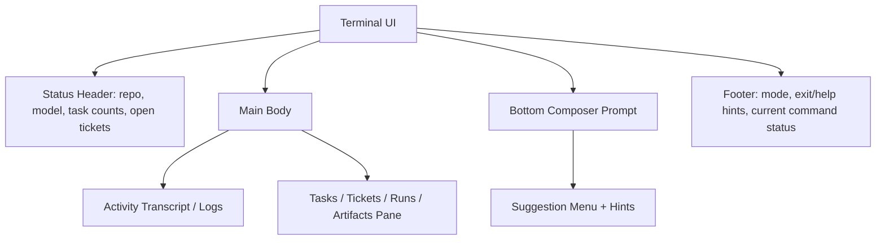
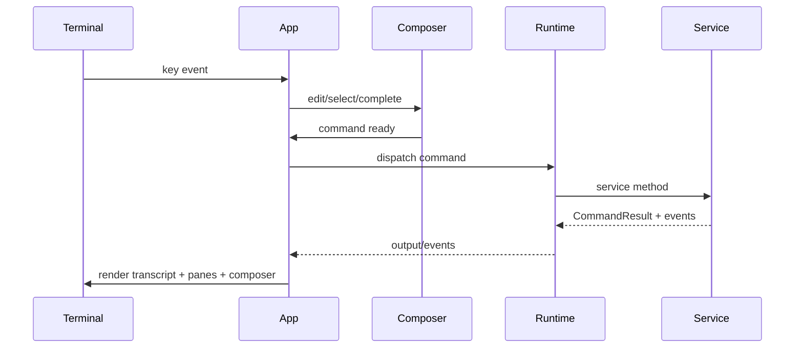
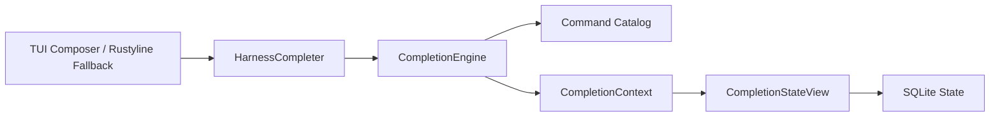
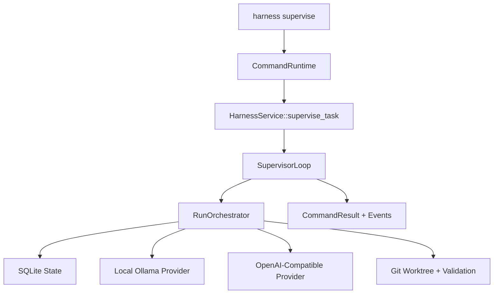
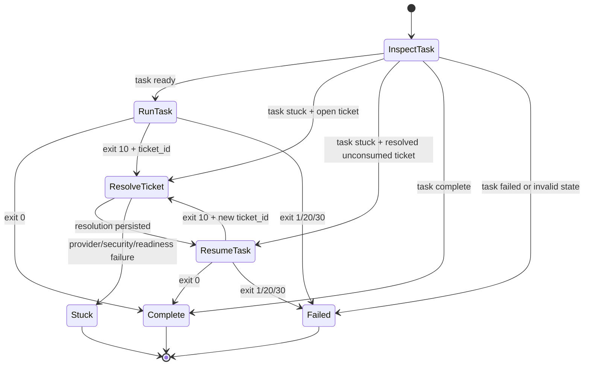
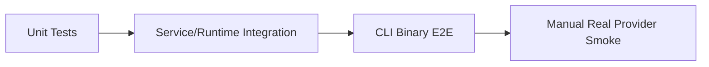

# Phase 2 Design: TUI, Autocomplete, and Supervised Execution

## Summary

Phase 2 completes the intended day-to-day harness experience by adding:

1. **A near-complete Codex-like terminal UI** for `harness` launched with no subcommand.
2. **Prompt autocomplete and contextual suggestions** for commands, flags, common values, task IDs, and ticket IDs.
3. **Foreground supervisor mode** that automates the existing manual loop:

```text
task run -> stuck ticket -> ticket resolve -> resume -> repeat until complete or escalation limit
```

The design keeps the MVP's core UX invariant:

- `harness <command> [inputs]` runs one command and exits with structured exit codes.
- `harness` with no command launches the interactive TUI/prompt over the same command runtime.

The first supervisor implementation is a foreground command, not a daemon. It should be resumable from persisted SQLite state, deterministic under fake providers, and fully validated by driving the actual CLI binary in end-to-end tests.

The UI target is the original `mvp-plan.md` TUI outline, with the prompt experience informed by Arm-Volt `volt-cli` PR 61 (`Add REPL style UI (similar to Codex)`). That TypeScript implementation should be translated into Rust concepts rather than copied directly:

- raw-mode prompt rendering
- command/value suggestions
- keyboard navigation through suggestions
- syntax highlighting
- hint rows when a command is incomplete
- shell-escape hint/execution behavior
- repeated in-process command execution without exiting the UI
- in-memory scoped suggestion caching

## Goals

- Deliver a usable terminal UI that is close to complete for core workflows: command composer, suggestions, activity transcript, task/ticket/status panes, shell escapes, and supervised task progress.
- Make interactive use practical through tab completion and keyboard navigation for commands, flags, common values, task IDs, and ticket IDs.
- Let a user or Codex run a single command that drives a task through local Ollama attempts, OpenAI-compatible ticket resolution, and resumed local work.
- Preserve MVP safety guarantees:
  - OpenAI-compatible output is advisory only.
  - Ticket resolutions are never directly applied as patches.
  - Ticket resolutions are consumed only after they are included in the next Ollama prompt.
  - Redaction runs before provider requests, output, artifacts, and persistence.
  - Existing patch safety and workspace isolation remain unchanged.
- Keep command definitions centralized so parser, help text, autocomplete, and future shell-completion generation do not drift.
- Validate the intended experience by invoking the compiled CLI binary, not only direct service injection.

## Non-Goals

- No background daemon or scheduler in this phase; the "background supervisor" from `next.md` is delivered as a foreground supervised command and TUI foreground workflow.
- No parallel multi-worker scheduling in this phase.
- No direct OpenAI patch application.
- No persistent shell history unless a later phase explicitly opts in; Phase 2 keeps in-memory session history only.
- No provider calls from autocomplete.
- No provider-backed model-name completion; model values are hint-only or config-static.
- No major UI functionality deferred beyond minor polish. The UI should be functionally complete for the MVP workflow by the end of this phase.

## MVP Deltas And Deferred Items

The original `mvp-plan.md` described a future architecture with worker list/start/stop commands and background worker activity. Phase 2 does not add a worker scheduler, daemon, or worker command set. The TUI may show task/run activity as the current "worker activity" representation, but dedicated worker panes and controls are deferred until a real worker model exists.

Phase 2 should be considered complete when the TUI supports the core workflows for task creation, task running/supervision, ticket visibility/resolution, shell escapes, logs/artifacts, and command suggestions. Remaining post-Phase-2 UI work should be minor polish or future worker/daemon functionality, not core usability.

## Current Baseline

The MVP already includes:

- `CommandRuntime` with repeated command execution in process.
- `CommandCatalog` and `build_clap` command tree.
- `InteractiveShell` backed by `rustyline::DefaultEditor` for TTYs and `BufReadLineEditor` for tests/piped input.
- `HarnessService` methods for:
  - `create_task`
  - `list_tasks`
  - `get_task`
  - `run_task`
  - `list_tickets`
  - `get_ticket`
  - `resolve_ticket`
  - `resume_task`
- `RunOrchestrator` with task run, stuck ticket creation, ticket resolution, resume semantics, artifact creation, redaction, and escalation-cycle enforcement.
- CLI binary e2e coverage for init/doctor/task flows.

The missing experience is a real terminal UI around those primitives, orchestration around manual ticket resolution, and completion over the runtime command surface.

## User Experience

### One-Shot CLI

```sh
harness --repo "$REPO" supervise <task-id> \
  --max-attempts 2 \
  --model maternion/strand-rust-coder:latest \
  --ticket-model gpt-5.3-codex \
  --output json
```

For Codex and other automation, Phase 2 also adds a create-and-supervise shortcut so a complete task can be launched with one command:

```sh
harness --repo "$REPO" supervise \
  --create \
  --title "Fix failing tests" \
  --goal "Make cargo test pass with the smallest safe patch" \
  --validation "cargo test" \
  --max-attempts 2 \
  --output json
```

Expected behavior:

1. If `--create` is supplied, create a task and supervise it immediately.
2. If an existing task is supplied and is `ready`, run it.
3. If it becomes `stuck`, resolve the open ticket.
4. Resume with the resolved ticket.
5. Repeat until complete or blocked.
6. Emit structured events and a final JSON object that includes the `task_id`.

### Interactive TUI

```sh
harness --repo "$REPO"
```

When stdin/stdout are TTYs, `harness` opens the terminal UI. The first viewport should be the actual working interface, not a landing/help page.

Core layout:



Expected panes:

- **Status header**: current repo, local model, ticket model, active task/run, open-ticket count, running command phase.
- **Transcript**: command output, supervisor progress, validation summaries, provider/status events, shell-escape output.
- **Side pane**: switchable views for tasks, tickets, recent runs, and artifacts/log paths.
- **Composer**: Codex-like prompt with command highlighting, suggestions, keyboard navigation, and shell escape support.
- **Footer**: compact key hints and current mode.

Prompt behavior, adapted from the Volt TypeScript PR:

- raw-mode input handling with a bottom prompt such as `> `
- render a divider above the prompt and suggestion list
- syntax-highlight command tokens, option tokens, and value tokens
- show at most a configured number of suggestions, default `8`
- show a hint row when a command is incomplete or no concrete completion is available
- Up/Down select suggestions when suggestions are visible
- Tab applies the only suggestion, longest common prefix, or selected suggestion
- Enter applies a selected suggestion before executing; otherwise executes only when the command is ready
- Ctrl-A/Ctrl-E move to start/end
- Ctrl-U clears before cursor
- Ctrl-W deletes previous word
- Backspace and Left/Right edit the composer
- Ctrl-C during normal editing clears the line or exits based on empty-line policy; Ctrl-D exits
- `exit` and `quit` leave the UI
- `help` runs the help command in the transcript
- `!<command>` runs a shell escape from the repo root with sanitized environment and displays output in the transcript
- invalid commands remain in the UI and show an error without terminating the session
- secret-looking commands are not recorded in in-memory history

Inside the composer:

```text
> task <TAB>
create  get  list  run  cleanup

> resume task_<TAB>
task_01J...  stuck  "Fix parser"

> supervise task_01J...
```

Expected behavior:

- Tab completes commands, subcommands, flags, common values, and known IDs.
- Suggestions include display context while inserting only the replacement value:
  - `task_...  stuck  "Fix parser"`
  - `ticket_...  open  run_...`
- Completion suggestions do not execute provider calls or long-running operations.
- The UI still supports `exit`, `quit`, Ctrl-C, Ctrl-D, in-memory history, invalid-command recovery, and `!<command>` shell escapes.
- Foreground long-running commands such as `supervise` block new prompt input while streaming events into the transcript.
- Ctrl-C during foreground `supervise` requests cooperative cancellation at the next safe boundary and emits the exact persisted resume command.

### Non-TTY Fallback

When stdin/stdout are not TTYs, `harness` with no command should keep the current non-interactive fallback behavior: run the supplied initial command if present or use a simple line-oriented shell for tests/piped input. Full TUI rendering must not run in non-TTY mode.

### Optional Shell Completion Export

Add a command after interactive completion is stable:

```sh
harness completions <bash|zsh|fish>
```

This is useful for one-shot CLI usage but is lower priority than interactive completion.

## TUI Design

### Rust Modules

Create a dedicated TUI module rather than stretching the current line-editor shell:

```text
src/tui/
  mod.rs
  app.rs
  input.rs
  render.rs
  composer.rs
  transcript.rs
  panes.rs
  theme.rs
```

Responsibilities:

- `app`: owns UI state, active pane, command execution state, and event loop.
- `input`: converts crossterm key events into editor actions.
- `composer`: editable prompt buffer, cursor, selection index, history, and suggestion state.
- `render`: ratatui layout and widget rendering.
- `transcript`: append-only activity/event model for command output and supervisor progress.
- `panes`: task/ticket/run/artifact side-pane models.
- `theme`: colors and stable visual styling.

### Event Loop



Execution model:

- Normal editing is synchronous and local.
- Command execution runs in a dedicated worker thread/task so the UI event loop can continue rendering, receiving Ctrl-C, and processing terminal resize events.
- Prompt editing is disabled while a foreground command is running, but the UI remains live.
- Runtime stdout/stderr chunks, structured events, command completion, and cancellation acknowledgements flow back to the UI through an internal channel.
- `supervise` uses the same runtime/service path as one-shot CLI and streams structured progress events into the transcript.
- Ctrl-C during command execution sends a cancellation request through a cancellation token. Cancellation is cooperative at safe boundaries: before provider calls, between provider calls, before validation, between supervisor cycles, and before resume.
- If cancellation cannot interrupt an in-flight provider/validation process immediately, the UI should show `cancelling after current step`.
- On cancellation, emit the persisted resume point and an exact next command such as `harness --repo <repo> supervise <task-id> --output json`.
- Terminal raw mode and alternate-screen state must be restored on normal exit, command panic, render error, and Ctrl-C/Ctrl-D exit.

Internal channel shape:

```rust
pub enum TuiRuntimeEvent {
    Stdout(String),
    Stderr(String),
    Progress(SuperviseProgressEvent),
    CommandFinished(CommandResult),
    CancelAcknowledged { next_command: Option<String> },
    Failed(String),
}
```

### Rendering Requirements

- The UI must render correctly in narrow terminals by stacking panes vertically.
- The composer and suggestion menu must have stable heights and avoid overlapping transcript content.
- Suggestion labels are aligned; details are truncated with ellipsis when needed.
- The selected suggestion is visually distinct.
- The transcript preserves scrollback for the current session.
- Side panes refresh after mutating commands and after supervisor cycles.
- Colors must be readable in standard dark and light terminal themes; avoid relying only on color to indicate selection/status.

### Pane Interaction Contract

Focus states:

- composer
- transcript
- side pane
- modal/help overlay

Pane switching and navigation:

| Key | Behavior |
| --- | --- |
| `Tab` in composer | Completion behavior. |
| `Ctrl-P` / `Ctrl-N` or configured equivalents | Switch active side pane: tasks, tickets, runs, artifacts/logs. |
| `PageUp` / `PageDown` | Scroll focused transcript or side pane. |
| `Shift-Up` / `Shift-Down` | Scroll transcript when composer is focused. |
| `Enter` on side-pane row | Insert the selected task/ticket ID into the composer or open a detail preview, depending on row type. |
| `Esc` | Return focus to composer or close detail preview. |
| `?` | Show key/help overlay. |

Side-pane data:

- **Tasks**: id, status, short title, latest run, updated time.
- **Tickets**: id, status, task id, run id, blocked_on, short question.
- **Runs**: id, task id, status, escalation cycle, current phase, latest artifact/log.
- **Artifacts/logs**: kind, path, byte length, hash prefix, associated task/run/ticket.

Worker panes from the original MVP plan are deferred because Phase 2 still has a foreground single-supervisor execution model and no worker scheduler. If worker state already exists later, it may be shown read-only, but no worker commands or background worker activity are required in Phase 2.

All panes need empty, loading, and error states. Panes refresh after mutating commands, after supervisor cycle events, and after explicit refresh.

### Key Bindings

| Key | Behavior |
| --- | --- |
| `Tab` | Apply only suggestion, longest common prefix, or selected suggestion. |
| `Enter` | Apply selected suggestion; otherwise execute if command is ready. |
| `Up` / `Down` | Move suggestion selection when suggestions are visible; otherwise navigate in-memory history. |
| `Left` / `Right` | Move cursor. |
| `Ctrl-A` / `Home` | Move cursor to start. |
| `Ctrl-E` / `End` | Move cursor to end. |
| `Ctrl-U` | Clear text before cursor. |
| `Ctrl-W` | Delete previous word. |
| `Backspace` | Delete previous character. |
| `Ctrl-C` while editing | Clear current line; if line is empty, exit after confirmation or second Ctrl-C. |
| `Ctrl-C` while command is running | Request cooperative cancellation at the next safe boundary and show resume command. |
| `Ctrl-D` | Exit when composer is empty. |
| `Esc` | Clear suggestion selection or close transient pane. |

### Prompt Reference From Volt PR 61

The TypeScript reference used:

- raw TTY input instead of a plain line editor
- an input buffer plus cursor index
- pending escape-sequence buffering
- selected suggestion index
- command readiness checks before execution
- suggestion kinds: command, builtin, option, value, hint
- command highlighting for subcommands, options, and values
- shell-escape detection with no CLI suggestions after `!`
- sanitized shell environment for shell escapes
- scoped recent-entity suggestions with loading/error hint rows

The Rust implementation should preserve those behaviors but use:

- `ratatui` and `crossterm` for terminal rendering and input
- existing `CommandRuntime` for execution
- the new command schema for command/option metadata
- the new completion engine for suggestions
- `DefaultEnvironmentSanitizer` for shell escapes
- SQLite-backed task/ticket suggestions instead of Volt job suggestions

The current `InteractiveShell` can remain as a simple non-TTY fallback and test harness, but TTY mode should route to the TUI by default.

### Shell Escape Contract

Shell escapes are part of the TUI, not a bypass around safety:

- Detection: any composer input whose trimmed form starts with `!`.
- Completion: no harness completions after `!`; show a hint row only.
- Execution: use the workspace command runner or an equivalent path with:
  - configured repo root as cwd
  - configured shell path with `-lc` semantics
  - `env_clear`
  - `DefaultEnvironmentSanitizer`
  - null stdin
  - timeout
  - max output bytes
  - process-group cleanup on timeout/cancellation
- Output: stdout/stderr stream into the transcript after redaction and terminal-control sanitization.
- Exit: nonzero exits render `[exit N]`; signal exits map to `128 + signal`.
- Cancellation: Ctrl-C during a shell escape kills the process group when supported and returns to the composer.
- History: secret-looking shell escape commands are not recorded in in-memory history.

Tests must prove sensitive env vars such as `OPENAI_API_KEY`, `ARM_OPENAI_API_KEY`, `AWS_SESSION_TOKEN`, `SSH_AUTH_SOCK`, cookies, proxy credentials, and private-key variables are absent from `!env` output.

### Transcript and Output Sanitization

All text entering the TUI transcript or side panes must pass through a single safe append/render path:

```rust
fn append_untrusted_text(source: TranscriptSource, text: &str)
```

That path must:

- redact with `DefaultRedactor`
- strip or safely render terminal control sequences, including ANSI CSI, OSC hyperlinks, OSC 52 clipboard writes, cursor movement, clear-screen, bracketed paste toggles, and other control characters
- enforce line and byte caps for transcript entries
- mark truncation explicitly

Only internal TUI widgets may add styling/control sequences. Untrusted shell output, validation output, provider text, task titles/goals, ticket details, artifact snippets, and command errors are never written raw to the terminal.

The same redaction boundary applies to human-mode supervisor progress lines, JSON events/final objects, side-pane labels/details, and any transcript capture used by tests.

## Command Surface Changes

### New Command: `supervise`

```text
supervise <task-id> [--ticket <ticket-id>] [--max-attempts <n>] [--model <ollama-model>] [--ticket-model <openai-model>] [--max-cycles <n>]
supervise --create --title <title> --goal <goal> --validation <cmd>... [--max-attempts <n>] [--model <ollama-model>] [--ticket-model <openai-model>] [--max-cycles <n>]
```

Options:

- `--create`: create a task and supervise it in the same command.
- `--title <title>`: required with `--create`.
- `--goal <goal>`: required with `--create`.
- `--validation <cmd>`: repeatable and required with `--create`.
- `--ticket <ticket-id>`: start by resolving/resuming a specific ticket when the task is already stuck.
- `--max-attempts <n>`: passed to each local run/resume invocation.
- `--model <ollama-model>`: local coding model for run/resume.
- `--ticket-model <openai-model>`: OpenAI-compatible model for ticket resolution.
- `--max-cycles <n>`: optional command-level cap on automatic ticket cycles. Defaults to configured `max_escalation_cycles`.

Exit codes:

- `0`: task completed.
- `1`: unrecoverable command failure.
- `2`: usage or parse error.
- `10`: task remains stuck after allowed cycles or an unresolvable stuck state is reached.
- `20`: provider readiness or dependency failure.
- `30`: security policy block.

### Command Catalog Update

The runtime catalog should become the source for:

- help output
- parser tests
- interactive completion
- optional generated shell completions

The current `CommandSpec { path, usage }` is not enough for robust completion. Replace or extend it with structured metadata:

```rust
pub struct CommandTreeSpec {
    pub name: &'static str,
    pub globals: &'static [OptionSpec],
    pub commands: &'static [CommandNodeSpec],
    pub meta_commands: &'static [MetaCommandSpec],
}

pub struct CommandNodeSpec {
    pub name: &'static str,
    pub about: &'static str,
    pub aliases: &'static [&'static str],
    pub hidden: bool,
    pub examples: &'static [&'static str],
    pub children: &'static [CommandNodeSpec],
    pub positionals: &'static [PositionalSpec],
    pub options: &'static [OptionSpec],
    pub action: CommandAction,
}

pub struct PositionalSpec {
    pub name: &'static str,
    pub value: ValueSpec,
    pub required: bool,
    pub repeatable: bool,
}

pub struct OptionSpec {
    pub long: &'static str,
    pub short: Option<char>,
    pub value_name: Option<&'static str>,
    pub value: Option<ValueSpec>,
    pub required: bool,
    pub repeatable: bool,
    pub action: OptionAction,
    pub conflicts_with: &'static [&'static str],
}

pub struct ValueSpec {
    pub kind: ValueKind,
    pub source: ValueSource,
    pub help: &'static str,
}

pub enum ValueKind {
    OutputMode,
    ProviderScope,
    TaskStatus,
    TicketStatus,
    TaskId,
    TicketId,
    Path,
    Model,
    FreeText,
    PositiveInteger,
}

pub enum ValueSource {
    Static(&'static [&'static str]),
    StateQuery(StateQueryKind),
    FilesystemPath,
    HintOnly,
    NoCompletion,
}

pub enum StateQueryKind {
    TaskId { statuses: &'static [&'static str] },
    TicketId { statuses: &'static [&'static str], scoped_to_task_arg: bool },
}
```

The command schema is the authoritative metadata source for help, TUI hints, completion, and shell completion export. For Phase 2, keep the existing `clap`/hand parser implementation but add strict parity tests that verify it matches the schema. Fully generating `clap` and the parser from the schema can be a later refactor.

The command schema must be rich enough to verify:

- `build_clap`
- `CommandCatalog::help`
- the hand parser and `ParsedCommand`
- interactive completion
- TUI help/hint text
- optional shell completion export

Phase 2 parity tests must prove the schema, `clap`, and parser agree on command paths, globals, positionals, options, value kinds, repeatability, and required arguments.

Meta-commands `exit`, `quit`, and `help` belong in metadata so TUI completion, hint rows, and help display remain consistent.

## Autocomplete Design

### Components



### Completion Engine API

Create `src/completion/mod.rs`.

Core API:

```rust
pub struct CompletionContext<'a> {
    pub state: &'a dyn CompletionStateView,
    pub repo: Option<PathBuf>,
    pub catalog: &'a CommandCatalog,
}

pub trait CompletionStateView {
    fn tasks_for_completion(&self, scope: TaskCompletionScope) -> HarnessResult<Vec<TaskCompletionItem>>;
    fn tickets_for_completion(&self, scope: TicketCompletionScope) -> HarnessResult<Vec<TicketCompletionItem>>;
}

pub struct CompletionCandidate {
    pub replacement: String,
    pub display: String,
    pub detail: String,
    pub kind: CompletionKind,
}

pub enum CompletionStatus {
    Ready,
    Loading,
    Error(String),
    Stale,
}

pub struct CompletionCacheKey {
    pub repo_identity: String,
    pub command_path: Vec<String>,
    pub value_kind: ValueKind,
    pub task_scope: Option<TaskId>,
}

pub enum CompletionKind {
    Command,
    Option,
    Value,
    TaskId,
    TicketId,
    MetaCommand,
    Hint,
}

pub trait CompleterEngine {
    fn complete(&self, line: &str, cursor: usize, context: &CompletionContext<'_>) -> HarnessResult<CompletionSet>;
}
```

`CompletionSet` should include:

- replacement start offset
- replacement end offset
- candidates
- optional longest common prefix
- completion status: ready/loading/error/stale
- optional hint row when no concrete completion is available

Dynamic completion must use `CompletionStateView`, not full `HarnessService`, so autocomplete cannot accidentally call mutating or provider-backed methods. Tests should use a fake state view that fails if any non-read path is reachable.

### Parsing for Completion

Autocomplete needs a tolerant parser, not the strict command parser. It should produce an explicit contract:

```rust
pub struct CompletionParse {
    pub tokens: Vec<CompletionToken>,
    pub cursor: usize,
    pub cursor_token: Option<usize>,
    pub trailing_empty_token: bool,
    pub active_command_path: Vec<String>,
    pub active_fragment: String,
    pub context: CompletionContextKind,
    pub quote_state: QuoteState,
}

pub struct CompletionToken {
    pub raw: String,
    pub value: String,
    pub start: usize,
    pub end: usize,
    pub quote: Option<char>,
}

pub enum CompletionContextKind {
    CommandOrSubcommand,
    OptionName,
    OptionValue { option: String, value_kind: ValueKind },
    PositionalValue { positional: String, value_kind: ValueKind },
    MetaCommand,
    ShellEscape,
    Unknown,
}
```

It should:

- tokenize shell-like input using the existing tokenizer where possible
- preserve cursor position
- preserve token byte spans and quote state
- detect whether the current fragment is:
  - command/subcommand
  - option name
  - option value
  - positional value
  - shell escape
  - quoted free-text argument
- handle `--flag=value`
- handle global options before and after command paths
- handle a leading binary name `harness`
- handle `--` terminator
- handle repeated options and missing option values
- handle cursor-in-middle edits and trailing whitespace
- return useful state for unterminated quotes instead of failing

Rules:

- If line starts with `!`, return a shell hint in the TUI and no harness completions.
- If line is `exit`/`quit` prefix, suggest meta-commands.
- If completing after `--output`, suggest `human` and `json`.
- If completing after `--providers`, suggest `local` and `all`.
- If completing task ID positionals/options, use `CompletionStateView::tasks_for_completion`.
- If completing ticket ID positionals/options, use `CompletionStateView::tickets_for_completion`.
- Scope dynamic IDs by command:
  - task IDs: `task get`, `task run`, `task cleanup`, `resume`, `supervise`
  - ticket IDs: `ticket get`, `ticket resolve`
  - task-scoped ticket IDs: `resume --ticket`, `supervise --ticket`
- If state cannot be loaded, static completions still work and dynamic completions return an empty set.
- Rank active/stuck/open entities before terminal entities.
- Candidate display should include status/title/run context; replacement remains the bare ID.
- Candidate `display` and `detail` must be redacted. `replacement` is limited to IDs, static values, or user-typed path fragments.
- Suggestion caches are session-only, bounded, redacted-only, keyed by canonical repo/state identity, and cleared on repo switch and TUI exit.
- Suggestion caches are invalidated after mutating commands and supervisor cycles.
- Do not cache ticket evidence JSON, provider responses, ticket resolutions, or raw task/ticket text.

### Command Readiness

The completion/parser layer should expose readiness for the TUI prompt:

```rust
pub enum CommandReadiness {
    Ready,
    Incomplete { missing: Vec<String>, hint: String },
    Invalid { diagnostic: String },
}
```

Readiness uses command metadata and tolerant parse output to decide whether Enter executes, appends a space, applies a hint, or displays a diagnostic. It must account for required positionals, required options, option conflicts, repeatable values, `--flag=value`, `--`, unterminated quotes, and free-text arguments.

### Completion Matrix

Task-list generation should include a completion matrix covering every command path. At minimum:

| Command path | Positionals | Options | Static values | Dynamic values |
| --- | --- | --- | --- | --- |
| `init` | none | `--repo` path | none | filesystem path only |
| `doctor` | none | `--offline`, `--providers`, `--deep` | `local`, `all` | none |
| `task create` | none | `--title`, `--goal`, `--validation` | none | recent validation commands may be session/config-static only |
| `task list` | none | `--status` | task statuses | none |
| `task get/run/cleanup` | task id | run/cleanup flags | none | task IDs |
| `ticket list` | none | `--status` | ticket statuses | none |
| `ticket get/resolve` | ticket id | `--model` hint-only | none | ticket IDs |
| `resume` | task id | `--ticket`, `--max-attempts`, `--model` | none | task IDs; task-scoped ticket IDs |
| `supervise` | task id or create args | `--create`, `--title`, `--goal`, `--validation`, `--ticket`, `--max-attempts`, `--model`, `--ticket-model`, `--max-cycles` | none | task IDs; task-scoped ticket IDs |
| `config get/set` | key/value | none | known config keys where available | none |
| `workspace prune` | none | `--dry-run`, `--force` | none | none |
| `version`, `help`, `exit`, `quit` | none | none | none | none |

### TUI and Rustyline Integration

The primary TTY path is the TUI composer. The completion engine should be UI-agnostic so both the TUI and the Rustyline fallback can consume it.

For the fallback line editor, replace `TerminalLineEditor`'s `DefaultEditor` with an editor configured with a helper:

```rust
Editor<HarnessRustylineHelper, DefaultHistory>
```

The helper implements:

- `rustyline::completion::Completer`
- optional `rustyline::hint::Hinter`
- optional `rustyline::highlight::Highlighter`
- `rustyline::validate::Validator`

`TerminalLineEditor::new` should accept a completion context factory, or an already-created helper, so tests can inject fake completion state.

The `LineEditor` trait can stay small for shell-loop tests; completion engine tests should target `completion` directly, while one TTY integration test can validate helper wiring without needing a real terminal.

### Dynamic Completion Safety

Dynamic completion may query SQLite via `CompletionStateView`.

It must not:

- run task attempts
- resolve tickets
- call providers
- run validations
- mutate state

If dynamic completion fails, return static completions and optionally log/debug a non-fatal completion error.

## Supervisor Design

### Components



### Service API

Add:

```rust
pub struct SuperviseTaskOptions {
    pub runtime: RuntimeOptions,
    pub ticket_id: Option<TicketId>,
    pub max_attempts: Option<u32>,
    pub model: Option<String>,
    pub ticket_model: Option<String>,
    pub max_cycles: Option<u32>,
}

pub struct SuperviseCreateOptions {
    pub runtime: RuntimeOptions,
    pub title: String,
    pub goal: String,
    pub validation_commands: Vec<String>,
    pub max_attempts: Option<u32>,
    pub model: Option<String>,
    pub ticket_model: Option<String>,
    pub max_cycles: Option<u32>,
}

fn supervise_task(
    &self,
    task_id: &TaskId,
    options: SuperviseTaskOptions,
) -> HarnessResult<CommandResult>;

fn create_and_supervise_task(
    &self,
    options: SuperviseCreateOptions,
) -> HarnessResult<CommandResult>;
```

`DefaultHarnessService` delegates to `RunOrchestrator::supervise_task`.

### Supervisor State Machine



### Loop Algorithm

Pseudo-code:

```rust
fn supervise_task(task_id, options) -> HarnessResult<CommandResult> {
    let max_cycles = min(
        options.max_cycles.unwrap_or(config.orchestrator.max_escalation_cycles),
        config.orchestrator.max_escalation_cycles,
    );
    let mut current_ticket = options.ticket_id.clone();
    let mut events = vec![];

    loop {
        recover_expired_leases(task_id)?;
        let task = store.get_task(task_id)?;

        match task.status {
            Complete => return complete_result(events),
            Failed => return failed_result(events),
            Ready => {
                let result = run_task(task_id, TaskRunOptions { ... })?;
                events.extend(result.events);
                match result.exit.status {
                    Complete => return complete_result(events),
                    Stuck => current_ticket = ticket_from_result_or_latest(task_id, result)?,
                    SecurityBlocked => return result_with_events(result, events),
                    DoctorFailed => return result_with_events(result, events),
                    _ => return result_with_events(result, events),
                }
            }
            Stuck => {
                let ticket = select_ticket_for_latest_stuck_run(task_id, current_ticket.as_ref())?;
                let next_cycle = next_resume_cycle_for_ticket(&ticket)?;
                if next_cycle > max_cycles {
                    return stuck_limit_result(events, ticket);
                }
                let resolution = latest_unconsumed_resolution(ticket)?;
                if resolution.is_none() {
                    let resolved = classify_errors(resolve_ticket(ticket.id, TicketResolveOptions { model: options.ticket_model }))?;
                    events.extend(resolved.events);
                }
                let resolution = requery_latest_unconsumed_resolution(ticket)?;
                events.push(resolution_event(&resolution));
                let result = resume_task(task_id, ResumeTaskOptions {
                    ticket_id: Some(ticket.id),
                    max_attempts: options.max_attempts,
                    model: options.model,
                })?;
                events.extend(result.events);
                current_ticket = ticket_from_result_if_stuck(result)?;
            }
            Running => return running_or_recovered_result(task_id),
        }
    }
}
```

Cycle progress must be derived from persisted run state, not process-local memory:

- each resume child run has an `escalation_cycle`
- the next supervised resume cycle is `latest_stuck_run.escalation_cycle + 1`
- `--max-cycles` is a command cap and cannot exceed configured `max_escalation_cycles`
- cycle limit is checked after selecting the latest stuck run/ticket and before any OpenAI-compatible provider call

### Ticket Selection

Selection rules:

1. Select the latest stuck run for the task using stable ordering: highest `started_at`, then highest `run_id`.
2. If `--ticket` is supplied, it must belong to the task and the latest stuck run. Stale tickets are rejected with exit `10` unless a later debug/unsafe option is introduced.
3. Prefer the latest resolved ticket on that run with an unconsumed resolution.
4. Otherwise select the latest open ticket on that run.
5. If the latest ticket is `resolving`, retry it only when the task lease is absent/expired or when prior resolution failed and state transition rules allow `failed -> resolving`.
6. If a ticket is `failed`, supervisor may retry resolution once the retry budget allows it.
7. If no open, resolving-retryable, failed-retryable, or resolved-unconsumed ticket exists, return stuck exit `10` with a clear message.

Ticket ordering is stable by `created_at`, then `ticket_id`.

This keeps the loop resumable:

- process interrupted before `ticket resolve`: next supervise resolves the open ticket
- interrupted after `ticket resolve`: next supervise resumes with unconsumed resolution
- interrupted during resume before provider send: resolution remains unconsumed
- interrupted after provider send: existing consumption semantics determine next state
- interrupted while ticket is `resolving`: next supervise either observes an active lease and reports conflict, or recovers stale resolving state and retries/marks failed according to state rules

### Running and Lease Recovery

If the task is `running` when supervision starts:

- active lease: return exit `1` with a conflict message and `next_commands` including `task get`
- expired lease: run existing lease recovery before inspection
- recovered failed run: return exit `1` with run/task details unless a later explicit retry flag is added
- recovered stuck run: continue with ticket selection

This prevents a restarted supervisor from bypassing persisted task/run state.

### Event and Output Contract

Human mode should print progress lines:

```text
supervise: cycle 0/3 task=task_... model=maternion/strand-rust-coder:latest phase=run
supervise: run=run_... attempt=1/2 validation="cargo test"
supervise: stuck ticket=ticket_... evidence=.harness/artifacts/...
supervise: resolving ticket=ticket_... model=gpt-5.3-codex
supervise: resolved ticket=ticket_... resolution=res_...
supervise: cycle 1/3 task=task_... phase=resume ticket=ticket_...
supervise: complete task=task_... run=run_...
```

JSON mode emits newline-delimited JSON progress events to stderr and one final JSON object to stdout. It must never mix prose into stderr when `--output json` is selected.

Progress event example:

```json
{"event":"supervise.phase","phase":"run","task_id":"task_...","run_id":"run_...","ticket_id":null,"cycle":0,"attempt":1,"status":"running","exit_code":null,"message":"running local task attempt","artifact_paths":[],"elapsed_ms":1234}
```

Required event fields:

- `event`
- `phase`
- `task_id`
- `run_id`
- `ticket_id`
- `cycle`
- `attempt`
- `status`
- `exit_code`
- `message`
- `artifact_paths`
- `elapsed_ms`

Event stream contract:

- stdout contains exactly one final JSON object.
- stderr contains chronological NDJSON progress events.
- `--quiet` suppresses nonessential human output but does not corrupt JSON output.
- all event and final-result fields are redacted before write.
- all nonzero final results include actionable `next_commands`.

Success final object:

```json
{
  "status": "complete",
  "exit_code": 0,
  "message": "task task_... complete after supervision",
  "data": {
    "task_id": "task_...",
    "cycles": 1,
    "resolved_tickets": ["ticket_..."],
    "resolution_ids": ["res_..."],
    "run_ids": ["run_...", "run_..."],
    "artifact_paths": [".harness/artifacts/..."],
    "next_commands": []
  }
}
```

For stuck limit:

```json
{
  "status": "stuck",
  "exit_code": 10,
  "message": "task task_... remains stuck after 2 supervised cycles",
  "data": {
    "task_id": "task_...",
    "ticket_id": "ticket_...",
    "cycles": 2,
    "next_commands": [
      "harness ticket get ticket_... --output json",
      "harness resume task_... --ticket ticket_... --output json"
    ]
  }
}
```

### Readiness Failures

Provider errors currently surface through command failures. Supervisor must catch and classify all run/resolve/resume errors into `CommandResult`s rather than letting `?` bypass the exit contract.

Error taxonomy:

| Condition | Exit |
| --- | --- |
| usage/parse error | `2` |
| missing provider config/API key | `20` |
| provider URL rejected by security policy | `30` |
| provider unavailable/timeout/model unavailable | `20` |
| provider response invalid for ticket resolution | `20` |
| patch/evidence security block | `30` |
| max supervised cycles reached | `10` |
| active lease conflict or unrecoverable internal failure | `1` |

Provider readiness failures include:

- missing OpenAI-compatible API key during automatic ticket resolution
- configured provider URL rejected by security policy
- provider model list/generation readiness failures if preflight is added

First implementation may avoid broad provider preflight, but runtime errors from provider calls still need stable exit-code classification.

## End-to-End Test Strategy

Phase 2 must be validated by driving the actual CLI binary where feasible.

### Binary Fake Provider Contract

CLI binary e2e tests must never hit real provider URLs.

Fixture setup:

- create a temp git repo with deterministic failing/passing Rust fixtures
- run `harness --repo <repo> init`
- rewrite `.harness/config.toml` so:
  - Ollama base URL points to a local fake HTTP server
  - OpenAI-compatible base URL points to a local fake HTTP server
  - OpenAI allow-untrusted URL is enabled only for local fake servers
  - API key env is set to a fake value
  - timeouts are short and deterministic
- install a request guard so any unexpected outbound host fails the test
- fake servers record all requests and expose request counts/bodies for assertions

Scripted provider scenarios:

- success after ticket:
  - `local[0] = STUCK reason/question`
  - `ticket[0] = advisory resolution`
  - `local[1] = valid patch`
- stuck limit:
  - local returns `STUCK` or failing patches until cycle cap
  - assert no extra OpenAI calls after cap is already reached
- provider readiness:
  - missing API key or rejected provider config
  - assert zero provider calls where configuration prevents dispatch
- security block:
  - secret-bearing evidence or unsafe patch
  - assert zero provider calls after security block

The fake local-provider response sequence is by request ordinal plus recorded metadata. Tests should assert the expected sequence exactly, for example local/openai/local for the success case.

### Test Layers



### Unit Tests

TUI/composer:

- key event handling for insert/delete/cursor movement
- Ctrl-A/E/U/W behavior
- suggestion selection with Up/Down
- Tab completion behavior for single suggestion, common prefix, and selected suggestion
- Enter applies selected suggestion before command execution
- command readiness hint behavior
- syntax highlighting token classes
- shell escape hint behavior
- in-memory history and secret-looking command filtering

Autocomplete:

- command completion at root
- nested command completion
- option-name completion
- option-value completion
- task ID completion with fake service
- ticket ID completion with fake service
- no harness completion for shell escapes
- quoted/free-text cursor handling
- cursor offsets and replacement spans
- global options before command paths
- leading `harness`
- `--flag=value`
- unterminated quotes
- dynamic query failure with static fallback
- task-scoped ticket completion
- schema parity against parser/clap

Supervisor:

- state selection when task is ready
- state selection when task is stuck with open ticket
- state selection when task is stuck with resolved unconsumed ticket
- max-cycle enforcement
- exit code mapping

### Integration Tests

- `CommandRuntime` dispatches `supervise` to `HarnessService::supervise_task`.
- TUI can execute `supervise <task-id>` using the same runtime.
- TUI can render a command transcript, suggestions, status header, and side pane from fake state.
- TUI foreground command execution disables composer input and re-enables it after completion.
- `TerminalLineEditor` helper delegates to `CompletionEngine`.
- `DefaultHarnessService::supervise_task` drives `RunOrchestrator` with fake providers.

### CLI Binary E2E Tests

Use temp fixture repos and fake HTTP providers where necessary so the compiled CLI binary is exercised.

Required e2e cases:

1. `harness --repo <repo> init`
2. `harness --repo <repo> task create ...`
3. `harness --repo <repo> supervise <task-id> --output json`
4. `harness --repo <repo> supervise --create --title ... --goal ... --validation ... --output json`
5. Fake local provider returns `STUCK`, fake OpenAI-compatible provider returns a resolution, fake local provider returns a valid patch on resume.
6. Assert final exit code `0`, completed task state, consumed resolution, artifacts/manifests, and no secret leaks.
7. Assert JSON progress on stderr is valid NDJSON with stable event fields.

Additional e2e cases:

- supervise exits `10` after repeated stuck cycles
- supervise exits `20` for missing ticket provider key/config
- supervise exits `30` for security-blocked evidence
- supervise `--create` returns `task_id`, `run_ids`, artifact paths, and `next_commands`
- interrupted/resumed workflow:
  - create stuck task
  - resolve ticket manually
  - run `supervise <task-id>`
  - assert it resumes rather than resolving again
- TUI smoke test through a pseudo-terminal:
  - launch `harness --repo <repo>`
  - type `task <Tab>`
  - assert suggestions render
  - type `exit`
  - assert terminal exits cleanly

### PTY Test Harness

TUI e2e tests need a stable screen model:

- fixed terminal size for each test
- time-bounded polling for prompt/sentinel text
- ANSI parsing or stripping into a virtual screen buffer
- cursor-control normalization rather than raw byte substring matching
- guaranteed terminal cleanup assertions after process exit

Required PTY cases:

- TTY route opens TUI; non-TTY route uses fallback
- `task <Tab>` renders task subcommands
- seeded `resume task_<Tab>` renders task IDs with status/title context
- Down/Enter and Tab insert selected suggestions
- invalid command stays in UI and shows a diagnostic
- `!env` proves shell environment sanitization
- shell escape output is redacted and terminal-control sanitized
- foreground `supervise` streams progress and disables composer input until completion
- Ctrl-C during foreground `supervise` requests cooperative cancellation and shows next command
- narrow and wide layouts do not overlap text
- side-pane switching and scrolling work
- transcript scrolling works

### NDJSON Assertions

For every `--output json` e2e:

- stdout parses as exactly one JSON document with no trailing prose
- every stderr line parses as one JSON object
- no non-JSON stderr lines are emitted
- every progress event has the required schema fields
- event order includes expected phases, such as run, stuck, resolve, resume, complete or failure
- process exit code equals final `exit_code`
- nonzero final results include `next_commands`

### Redaction Assertions

Use a sentinel redaction fixture with secrets in:

- task title/goal
- validation stdout/stderr
- provider responses
- provider errors
- shell escape output
- environment variables
- artifact text

E2E scans must cover:

- stdout
- stderr
- TUI transcript capture
- SQLite bytes and relevant text fields
- artifact/log/manifest files
- fake-provider captured requests
- side-pane rendered labels/details

Raw sentinel values must be absent and expected redaction markers must appear where user-visible evidence remains.

Direct SQLite inspection should include task fields, ticket evidence/question/reason, ticket resolutions, run events, artifacts, provider response metadata/messages, and any serialized event table.

### Early Binary Acceptance

Split e2e work into two phases:

- `F0`: land fixture repo creation, fake provider config injection, binary runner, stdout/stderr/exit-code capture, request recorder, and pending/ignored supervise e2e skeleton immediately after command parsing.
- `F1`: enable full supervise/TUI scenarios once supervisor and TUI implementation are functional.

### Manual Smoke

Update `docs/test-owned/real-provider-smoke.md` with:

```sh
harness --repo /path/to/disposable/repo supervise <task-id> --max-attempts 1 --output json
```

## Parallel Workstreams

The implementation should be split so subagents can work in parallel with minimal write conflicts.

### Workstream 0: Interface Seed and Contracts

Owned files:

- `src/runtime/catalog.rs`
- `src/runtime/supervise.rs`
- `src/runtime/events.rs`
- `src/service/supervisor.rs`
- module export lines in `src/runtime/mod.rs` and `src/service/mod.rs`

Scope:

- add `SuperviseTaskOptions` and `SuperviseCreateOptions`
- add `supervise_task` and `create_and_supervise_task` trait signatures with placeholder implementations where needed
- land command schema data types without migrating every command yet
- define `SuperviseProgressEvent`
- define TUI-facing `TranscriptEvent`, `PaneStateSnapshot`, and cancellation token contracts
- define supervisor state-view/store trait signatures needed by later workstreams

Dependencies:

- none

Produces:

- stable interfaces for parallel workstreams
- typed event/output contracts
- reduced shared-file conflict surface

Acceptance gate:

- `cargo test runtime::supervise service::supervisor`
- trait placeholders compile without changing existing command behavior
- reviewers confirm later workstreams have stable contracts and no large shared-file ownership conflicts

### Workstream A: Command Metadata and Parser Surface

Owned files:

- `src/runtime/catalog.rs`
- `src/runtime/parser.rs`
- minimal module wiring in `src/runtime/mod.rs`
- runtime parser tests

Scope:

- make structured command metadata authoritative for help/completion
- add `supervise` parse support
- add `supervise --create` parse support
- keep help output stable
- expose metadata for completion
- add schema/clap/parser parity tests

Dependencies:

- Workstream 0 interface seed

Produces:

- command metadata API
- parsed supervise command
- parity gate for command drift

Acceptance gate:

- `cargo test runtime`
- parser accepts all documented `supervise` forms
- schema/clap/parser parity test passes
- help output includes TUI/meta/supervise command surface

### Workstream B: Completion Engine

Owned files:

- `src/completion/**`
- completion unit tests

Scope:

- tolerant token/cursor analysis
- command readiness API
- static command/flag/value completion
- dynamic task/ticket ID completion through `CompletionStateView`
- display labels with redacted task/ticket status/title/run context
- task-scoped ticket completion
- hint/loading/error/stale rows and session-only scoped cache
- no-provider-call guarantee

Dependencies:

- Workstream A metadata shape, but can begin against Workstream 0 draft interfaces

Produces:

- `CompletionEngine`
- completion test suite

Acceptance gate:

- `cargo test completion`
- tests cover cursor offsets, global options, leading `harness`, scoped IDs, dynamic failure fallback, hint/loading/error rows, redacted display text, and no shell completions after `!`

### Workstream C1: TUI State, Layout, and Rendering

Owned files:

- `src/tui/app_state.rs`
- `src/tui/render.rs`
- `src/tui/panes.rs`
- `src/tui/transcript.rs`
- `src/tui/theme.rs`
- TUI render/model tests

Scope:

- implement ratatui layout models
- implement status header, footer, transcript, and switchable side panes
- implement pane focus, selection, scrolling, empty/loading/error states
- implement transcript redaction/control-sequence sanitization boundary
- implement narrow/wide responsive layout behavior

Dependencies:

- Workstream 0 TUI contracts

Produces:

- TUI state/render foundation

Acceptance gate:

- `cargo test tui::render tui::panes tui::transcript`
- render snapshots/model tests cover narrow/wide layout, side-pane switching, transcript scrolling, redaction, and control-sequence sanitization

### Workstream C2: Composer, Input, and Completion UI

Owned files:

- `src/tui/composer.rs`
- `src/tui/input.rs`
- composer/input tests

Scope:

- implement Codex-like composer prompt based on Volt PR 61 behavior
- implement raw key handling and command readiness hints
- wire completion engine into the composer
- implement in-memory history and secret-looking command filtering
- implement Tab, Enter, Up/Down, Ctrl-A/E/U/W, Ctrl-C/D, Esc behavior

Dependencies:

- Workstream B engine API
- Workstream A command metadata
- Workstream C1 render contracts

Produces:

- near-complete prompt/composer behavior

Acceptance gate:

- `cargo test tui::composer tui::input completion`
- tests cover every key binding, suggestion insertion, readiness hints, history filtering, and scoped ID completion display

### Workstream C3: TUI Runtime and Shell Integration

Owned files:

- `src/tui/app.rs`
- `src/tui/runtime_bridge.rs`
- `src/tui/shell_escape.rs`
- `src/cli/mod.rs` only for TTY routing

Scope:

- route `harness` with no TTY subcommand to the TUI
- execute runtime commands on a worker thread/task through event channels
- implement cancellation token and cooperative Ctrl-C behavior
- stream runtime/supervisor/shell output to transcript
- implement shell escape contract through sanitized command runner
- support `supervise` in TUI mode via existing runtime

Dependencies:

- Workstream C1
- Workstream C2
- Workstream D typed events

Produces:

- functional TUI session and foreground command execution

Acceptance gate:

- `cargo test tui::app tui::shell_escape interactive`
- tests cover terminal cleanup, command execution event flow, shell env sanitization, Ctrl-C cancellation, and no raw secret/control sequence in transcript

### Workstream C4: Rustyline Fallback Integration

Owned files:

- `src/interactive/fallback.rs`
- module export lines in `src/interactive/mod.rs`
- fallback interactive tests

Scope:

- optionally add rustyline helper for the fallback editor
- keep non-TTY/piped behavior stable
- ensure fallback uses the same completion engine where practical
- explicitly avoid `load_history`, `save_history`, or creating history files

Dependencies:

- Workstream B engine API

Produces:

- lower-risk fallback path that does not block TUI completion

Acceptance gate:

- `cargo test interactive`
- no persistent history file is loaded/saved/created
- non-TTY behavior remains compatible with current tests

### Workstream E: Orchestrator/State Helpers

Owned files:

- `src/orchestrator/supervisor_state.rs`
- `src/state/supervisor_queries.rs`
- minimal module wiring in `src/orchestrator/mod.rs` and `src/state/mod.rs`

Scope:

- helper for latest ticket on latest stuck run
- helper for latest unconsumed resolved ticket
- helper for retryable resolving/failed ticket states
- helper for latest stuck run and persisted next cycle
- stable supervised-result data
- ensure lease semantics remain valid

Dependencies:

- Workstream 0 supervisor state-view/store contracts

Produces:

- supervisor-safe state selection APIs

Acceptance gate:

- `cargo test state::supervisor_queries orchestrator::supervisor_state`
- fake-store tests prove latest stuck run ordering, task-scoped ticket selection, stale ticket rejection, retryable resolving/failed tickets, and persisted next-cycle calculation

### Workstream D: Supervisor Core

Owned files:

- `src/supervisor/**` or `src/orchestrator/supervisor.rs`
- `src/service/supervisor.rs`
- supervisor unit tests

Scope:

- implement `SuperviseTaskOptions`
- implement `SuperviseCreateOptions`
- supervisor loop
- task/ticket state selection through Workstream E helpers
- persisted cycle limit enforcement
- resolving/running recovery semantics
- typed event aggregation
- exit code mapping
- NDJSON progress event generation through runtime event contract
- `next_commands` generation

Dependencies:

- Workstream 0 option/event types
- Workstream E supervisor-safe state selection APIs

Produces:

- service-level `supervise_task`
- service-level `create_and_supervise_task`

Acceptance gate:

- `cargo test supervisor orchestrator::supervisor`
- tests cover ready->complete, stuck->resolve->resume->complete, persisted cycle cap, resolving/failed ticket recovery, active/expired running lease behavior, provider/security exit mapping, cancellation safe points, and resolution not consumed before resume provider send

### Workstream F0: Binary E2E Harness

Owned files:

- `tests/support/binary.rs`
- `tests/support/fake_providers.rs`
- `tests/support/fixtures.rs`
- `tests/e2e.rs` skeleton wiring

Scope:

- fixture repo creation
- fake provider config injection
- binary command runner
- stdout/stderr/exit-code capture
- fake-server request recording
- pending/ignored supervise acceptance skeletons

Dependencies:

- Workstream A command parsing

Produces:

- early actual-binary acceptance harness

Acceptance gate:

- `cargo test --test e2e binary_harness`
- tests prove no real provider URLs are reachable and fake providers record requests

### Workstream F1: Supervisor CLI E2E

Owned files:

- `tests/e2e.rs`
- `tests/support/**`
- `docs/test-owned/real-provider-smoke.md`

Scope:

- fake HTTP provider e2e wiring for CLI binary
- supervise success e2e
- supervise `--create` e2e
- supervise stuck-limit e2e
- missing provider readiness e2e
- redaction assertions
- NDJSON progress assertions
- update manual smoke docs

Dependencies:

- Workstreams A, D, E, and F0

Produces:

- actual CLI acceptance tests

Acceptance gate:

- `cargo test --test e2e supervise`
- tests cover success, stuck limit, readiness exit `20`, security exit `30`, create-and-supervise, request-count assertions, NDJSON schema/order, direct SQLite redaction, artifacts, and provider request redaction

### Workstream F2: TUI PTY E2E

Owned files:

- `tests/tui_pty.rs` or `tests/e2e.rs`
- `tests/support/pty.rs`

Scope:

- pseudo-terminal test harness
- TUI startup/exit smoke
- prompt suggestions and dynamic ID completion
- side-pane switching
- shell escape env/redaction test
- supervise streaming/cancellation test

Dependencies:

- Workstreams A, B, C1, C2, C3, and F0

Produces:

- actual TUI acceptance tests

Acceptance gate:

- `cargo test --test tui_pty`
- tests use normalized virtual screen assertions, fixed terminal sizes, and no raw sleeps

### Workstream G: Optional Shell Completion Export

Owned files:

- `src/completion/shell.rs`
- minimal command wiring in `src/runtime/parser.rs`
- tests for generated completion command

Scope:

- add `harness completions <shell>`
- use `clap_complete` or equivalent only after schema/clap parity is green
- keep lower priority than TUI completion

Dependencies:

- Workstream A command metadata/clap alignment

Produces:

- installable shell completion output

Acceptance gate:

- `cargo test completion::shell runtime`
- generated completions reflect command schema and parity tests remain green

## Implementation Order

1. Workstream 0 seeds shared interfaces, typed events, TUI contracts, and supervisor state-view traits.
2. Workstream A defines metadata and `supervise` command parsing.
3. Workstream F0 starts early binary-e2e harness work as soon as A exposes the command surface.
4. Workstreams B, C1, and E proceed in parallel:
   - B builds completion engine using metadata.
   - C1 builds pure TUI state/render/transcript models.
   - E builds supervisor-safe state/orchestrator helpers.
5. Workstream D builds the supervisor loop once E's helper contracts are available.
6. Workstream C2 builds composer/input after B and C1 are stable.
7. Workstream C3 wires TUI runtime/shell execution after C1/C2 and D typed events are stable.
8. Workstream C4 updates fallback line-editor behavior in parallel with C2 when B is stable.
9. Workstream F1 adds supervisor CLI e2e once A/D/E/F0 are functional.
10. Workstream F2 adds TUI PTY e2e once A/B/C1/C2/C3/F0 are functional.
11. Workstream G is optional and can run after A, or be deferred if TUI completion and supervisor acceptance are not yet solid.

## How To Generate Parallel Task Lists

Create one task-list file per workstream under `.ai-context/tasks/phase-2/`.

Each task list should include:

- owned files
- shared files
- dependencies
- implementation checklist
- tests to add
- acceptance command
- review checklist
- done criteria

Task lists should use markdown to-do format:

```markdown
- [ ] Implement structured command metadata.
- [ ] Add parser coverage for `supervise`.
- [ ] Run `cargo test runtime`.
- [ ] Reviewer has passed this workstream.
```

Cross-workstream coordination rules:

- Workstream 0 owns shared contracts and module exports. Later workstreams should not expand shared traits without coordinating a small interface patch first.
- Workstream A owns metadata shape. Other workstreams should consume it rather than duplicating command lists.
- Workstreams C1/C2/C3 own TUI rendering/input/runtime integration respectively; other workstreams should expose state/events rather than drawing UI.
- Workstream D owns supervisor semantics. Runtime and e2e workstreams should not reimplement the loop.
- Workstreams F0/F1/F2 own binary and PTY acceptance. Unit/integration tests in other streams should remain focused.
- If a workstream needs a shared interface change, land the smallest trait/type change first and document it in the task file.

## Risks and Mitigations

| Risk | Mitigation |
| --- | --- |
| Command metadata drifts from parser behavior | Generate completion from structured metadata and add parser/catalog consistency tests. |
| Autocomplete accidentally performs expensive work | Limit dynamic completion to `CompletionStateView`; test with a state view that cannot run/resolve/resume. |
| TUI scope expands beyond core functionality | Treat Phase 2 UI as functionally complete for core workflows, but keep visual polish and noncore enhancements out of scope. |
| TUI tests become flaky | Keep most logic in pure composer/render models; use pseudo-terminal smoke tests sparingly for final integration. |
| Supervisor consumes ticket resolution too early | Preserve existing resume semantics and add regression tests for provider-send failure without consumption. |
| Supervisor loops forever | Enforce `--max-cycles` and config `max_escalation_cycles`; persist cycle progress via existing run escalation cycle. |
| CLI e2e cannot inject fake providers | Add env/config-supported fake HTTP provider wiring for binary tests, reusing existing fake HTTP providers. |
| JSON output becomes noisy | Keep final JSON on stdout and NDJSON events on stderr with a fixed schema. |
| OpenAI failures are misclassified | Use the Phase 2 error taxonomy and test missing config, policy rejection, provider unavailable, and invalid response. |

## Open Questions

1. Should shell completion export be required for Phase 2, or treated as a stretch after interactive completion?
2. Should `supervise` preflight providers with doctor checks before starting, or only react to provider failures as they occur?
3. Should dynamic completion include model names from provider model listing? Current recommendation: no, because autocomplete must not call providers.
4. Should Ctrl-C while editing exit immediately on an empty line, or require a second Ctrl-C/confirmation? The design requires cooperative cancellation while commands run, but empty-line exit UX can be finalized during TUI implementation.
