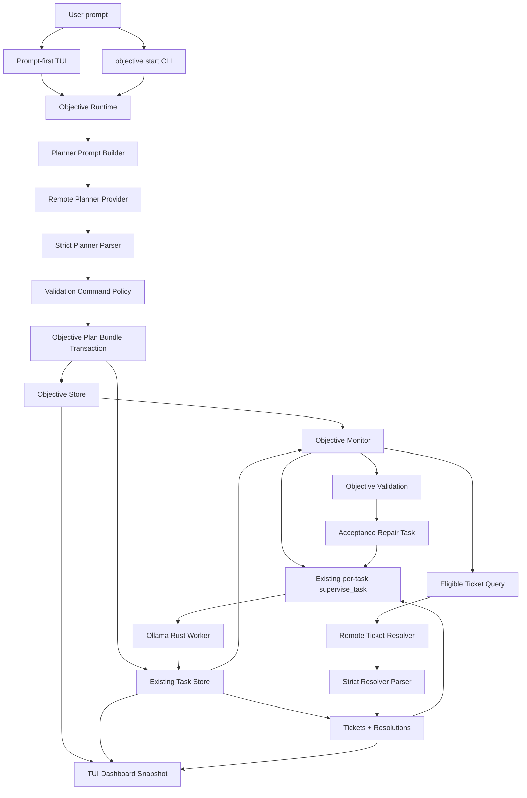
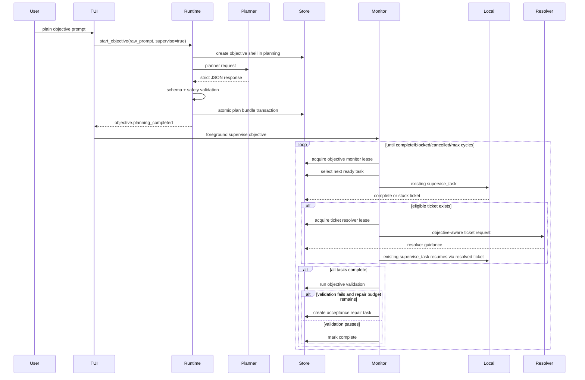

# Phase 3 Design: Prompt-First Objective Orchestration

Design source: `.ai-context/phase-3/Plan.md` and `.ai-context/phase-2/Next.md`.

Review status: revised after 10 independent design reviews.

## Summary

Phase 3 changes the primary `harness` workflow from command-first task supervision to prompt-first objective orchestration.

The user should be able to enter a high-level objective:

```text
Create a Rust clone of the Volt CLI in this repository: https://github.com/Arm-Volt/volt-cli
```

`harness` then:

1. Sends the objective, repository context, and system planning instructions to the OpenAI-compatible remote planner.
2. Receives a strict structured plan.
3. Validates the plan and generated validation commands.
4. Persists objective state, acceptance criteria, planner exchanges, objective artifacts, and generated tasks.
5. Runs generated tasks through the local Ollama-hosted Rust model.
6. Uses the remote model again only when an eligible open ticket needs resolution.
7. Resumes local Ollama work with resolved ticket guidance.
8. Repeats until acceptance criteria pass, the objective is blocked, cancellation occurs, or configured limits are reached.

The TUI becomes Codex-like in the prompt, but remains different from a plain chat interface by keeping visible panels for objective progress, running tasks, local workers, open tickets, validation state, remote model activity, and transcript events.

## Phase 3 Scope

Phase 3 deliberately stays narrow enough to ship and test end-to-end.

In scope:

- Prompt-first objective start in the TUI.
- One-shot CLI objective start/supervise commands.
- A strict remote planner schema.
- Objective persistence and objective-specific artifacts.
- Generated local tasks backed by existing task/run/ticket state.
- Sequential objective monitor loop.
- Objective-aware ticket resolution context.
- Objective validation and acceptance repair loop.
- Slash-command compatibility for manual commands in the TUI.
- Panel-rich TUI dashboard.
- Binary CLI and PTY TUI e2e tests with fake providers.

Out of scope for Phase 3:

- Automatic replanning.
- Parallel local workers.
- Background daemon mode.
- Generated executable script files.
- Remote-model patch application.
- Provider-backed model-name completion.

Replanning may be added later as an explicit user command. The Phase 3 monitor must not automatically replan and must not use the remote planner as normal implementation help.

## Core Invariants

- One initial remote planner call is allowed per objective version.
- Remote ticket resolver calls are allowed only for eligible tickets.
- No remote calls happen between normal local worker attempts.
- The remote planner and resolver never apply patches.
- Only local implementation provider output may enter patch parsing/application.
- Planner and resolver outputs are untrusted until schema and safety validation pass.
- Existing task, run, ticket, ticket resolution, artifact redaction, workspace isolation, and patch-safety guarantees remain in force.
- Phase 3 local task execution is sequential. The schema records parallel groups and owned paths for later phases, but Phase 3 does not run parallel local workers.

## Model Roles

| Role | Provider | Responsibilities | Forbidden |
| --- | --- | --- | --- |
| Remote planner | OpenAI-compatible | Define done, acceptance criteria, validation commands, generated task graph | Patches, shell scripts, direct repo mutation |
| Local worker | Ollama Rust model | Implement bounded tasks through existing patch loop | Remote calls during normal attempts |
| Remote ticket resolver | OpenAI-compatible | Diagnose a stuck ticket and return bounded guidance | Patches, executable scripts, direct repo mutation |
| Harness runtime | Local Rust program | Validate, persist, schedule, enforce safety, render progress | Trust remote output blindly |

Provider interfaces should make the boundary enforceable:

```rust
trait RemotePlanningProvider {
    fn plan_objective(&self, request: PlannerRequest) -> ProviderFuture<'_, PlannerRawResponse>;
}

trait RemoteTicketResolverProvider {
    fn resolve_objective_ticket(
        &self,
        request: TicketResolverRequest,
    ) -> ProviderFuture<'_, TicketResolverRawResponse>;
}

trait LocalImplementationProvider {
    fn complete_local_task(&self, request: ModelRequest) -> ProviderFuture<'_, ModelResponse>;
}
```

The concrete implementation may wrap existing `ModelProvider`, but service boundaries and tests should distinguish planner, resolver, and local worker call ledgers.

## User Experience

### TUI

Run:

```sh
harness --repo "$REPO"
```

If no objective is active, plain input starts and supervises an objective:

```text
> Create a Rust clone of the Volt CLI in this repository: https://github.com/Arm-Volt/volt-cli
```

This is equivalent to:

```sh
harness objective start "<prompt>" --supervise
```

TUI prompt state machine:

- No active objective: plain input starts `objective start --supervise`.
- Active running objective: prompt editing is disabled except cancellation controls; panels and transcript continue updating.
- Completed, blocked, failed, or cancelled objective: plain input starts a new objective.
- Follow-up prompts are not supported in Phase 3. They require a future explicit replanning design.

Manual commands use slash mode:

```text
> /objective list
> /objective get objective_01...
> /task list
> /ticket list --status open
```

Shell escapes remain:

```text
> !git status --short
```

Compatibility guard:

- If plain prompt text begins with a known command root such as `task`, `ticket`, `resume`, `supervise`, `config`, `workspace`, `doctor`, `init`, or `objective`, the TUI must not silently create an objective.
- It should show a transcript warning such as `Use /task list to run harness commands in prompt-first mode.`

### CLI

Prompt input forms:

```sh
harness objective start Create a Rust clone of the Volt CLI in this repository: https://github.com/Arm-Volt/volt-cli
harness objective start --prompt "Create a Rust clone of the Volt CLI in this repository: https://github.com/Arm-Volt/volt-cli"
harness objective start --prompt-file ./objective.txt
cat objective.txt | harness objective start --stdin
```

The positional prompt is trailing variadic text joined with spaces. `--prompt`, `--prompt-file`, and `--stdin` conflict with the variadic prompt and with each other.

Start and supervise in one foreground command:

```sh
harness --repo "$REPO" objective start \
  --prompt "Create a Rust clone of the Volt CLI in this repository: https://github.com/Arm-Volt/volt-cli" \
  --supervise \
  --max-worker-attempts 32 \
  --output json
```

Supervise an existing objective:

```sh
harness --repo "$REPO" objective supervise objective_01... \
  --max-worker-attempts 32 \
  --max-cycles 16 \
  --output json
```

Inspect state:

```sh
harness objective list [--status planning|ready|running|blocked|complete|failed|cancelled]
harness objective get <objective-id>
harness objective plan <objective-id>
harness objective validate <objective-id> [--dry-run]
harness objective cancel <objective-id>
```

`objective start --supervise` and `objective supervise` are foreground commands in Phase 3. They run until terminal state, cancellation, or configured cycle limit. Nonblocking behavior should use a future `--detach`, not Phase 3 `--supervise`.

## Exit Codes And JSON Contract

Exit codes:

- `0`: command completed successfully; supervised objective is complete.
- `1`: runtime failure, blocked objective, validation failure after repair budget exhausted, resolver failure, or max cycles exhausted.
- `2`: usage error, parse error, invalid schema, unsafe planner output, or invalid command input.
- `10`: reserved for existing task-level stuck result.
- `20`: doctor/readiness failure.
- `30`: security policy blocked operation.

For `--output json`:

- stdout contains exactly one final JSON object.
- stderr contains NDJSON event envelopes only.
- stderr must not contain human `info:` lines or mixed prose.

Event envelope:

```json
{
  "event": "objective.worker_started",
  "schema_version": 1,
  "level": "info",
  "objective_id": "objective_...",
  "task_id": "task_...",
  "ticket_id": null,
  "phase": "running",
  "message": "running generated task",
  "timestamp": "2026-05-14T12:00:00Z",
  "next_command": "harness objective get objective_... --output json",
  "payload": {}
}
```

Final supervised JSON:

```json
{
  "objective_id": "objective_...",
  "plan_id": "plan_...",
  "status": "complete",
  "terminal": true,
  "exit_reason": "acceptance_passed",
  "task_ids": ["task_..."],
  "open_ticket_ids": [],
  "validation": {
    "status": "passed",
    "commands_run": 2,
    "commands_skipped": 0
  },
  "next": "harness objective get objective_... --output json"
}
```

## Architecture



## Runtime Sequence



## Command Catalog And Completion

Add value kinds:

```rust
ValueKind::ObjectiveId
ValueKind::ObjectiveStatus
StateQueryKind::ObjectiveId { statuses: &'static [&'static str] }
```

Add command group:

```text
objective start [<prompt>...] [--prompt <text>|--prompt-file <path>|--stdin] [--supervise] [--planner-model <model>] [--worker-model <model>] [--ticket-model <model>] [--max-worker-attempts <n>] [--max-cycles <n>]
objective list [--status <status>]
objective get <objective-id>
objective plan <objective-id>
objective supervise <objective-id> [--worker-model <model>] [--ticket-model <model>] [--max-worker-attempts <n>] [--max-cycles <n>]
objective validate <objective-id> [--dry-run]
objective cancel <objective-id>
```

Completion requirements:

- Objective status static completions appear for `objective list --status`.
- Dynamic objective ID completions appear for `get`, `plan`, `supervise`, `validate`, and `cancel`.
- Shell completions for bash/zsh/fish include objective commands and static statuses.
- Existing Phase 2 commands remain in help, parser, clap, completion, and shell completions.

## TUI Input Mode Contract

Add `InputMode`:

```rust
enum InputMode {
    Prompt,
    SlashCommand,
    ShellEscape,
}
```

Mode detection:

- Buffer starts with `/`: `SlashCommand`
- Buffer starts with `!`: `ShellEscape`
- Otherwise: `Prompt`

Slash-command adapter:

- Display buffer includes `/`.
- Completion engine receives `buffer[1..]` and `cursor - 1`.
- Completion replacement spans are shifted by `+1` before applying to the visible buffer.
- Submission strips `/` and dispatches the command runtime.
- History stores the visible slash form so user recall matches what they typed.

Prompt mode:

- No harness command autocomplete by default.
- Plain `ta<Tab>` must not complete to `task`.
- Known command roots show a warning suggesting slash mode.
- TUI plain prompt bypasses command tokenization and calls objective service with the raw composer buffer.

Shell escape mode:

- Phase 2 semantics remain unchanged for cwd, sanitized environment, redaction, cancellation, output capture, and secret-filtered history.

## TUI Dashboard

Use a unified snapshot so objective panels do not replace existing Phase 2 panes:

```rust
DashboardPaneSnapshot {
    phase2: PaneStateSnapshot,
    objective: Option<ObjectivePaneSnapshot>,
}
```

Objective snapshot:

```rust
ObjectivePaneSnapshot {
    objective: ObjectiveHeader,
    acceptance: PaneSection<AcceptanceCriterionRow>,
    tasks: PaneSection<ObjectiveTaskRow>,
    tickets: PaneSection<ObjectiveTicketRow>,
    validation: PaneSection<ObjectiveValidationRow>,
    planner: PaneSection<PlannerExchangeRow>,
}
```

Visible lifecycle states required in panels:

- Objective: `planning`, `ready`, `running`, `resolving`, `validating`, `blocked`, `complete`, `failed`, `cancelled`
- Worker row: `queued`, `running`, `stuck`, `resuming`, `complete`, `failed`
- Ticket row: `open`, `resolving`, `resolved`, `failed`, `consumed`
- Validation row: `pending`, `running`, `passed`, `failed`, `needs_review`, `rejected`, `skipped`
- Planner/resolver row: `queued`, `running`, `failed`, `accepted`, `rejected`

While a foreground objective monitor is running:

- Prompt editing is disabled.
- Panels and transcript continue updating.
- `Ctrl-C` requests objective cancellation, not TUI exit.
- The TUI remains open after cancellation acknowledgment.

## Planner Response Contract

Remote planner output must be a single strict JSON object:

- No markdown fences.
- No leading or trailing prose.
- `schema_version` required.
- Unknown fields rejected.
- Max response bytes enforced before full parse where possible.
- Max task count enforced.
- Max validation command count enforced.
- Max string lengths enforced.

Prefer provider structured output / JSON schema response format when available. If unavailable, use a JSON-only prompt and strict parser. Never extract JSON from prose in Phase 3.

Schema:

```json
{
  "schema_version": 1,
  "objective": {
    "title": "Create Rust clone of Volt CLI",
    "summary": "Implement a Rust CLI with the core behavior and command surface of Arm-Volt/volt-cli.",
    "acceptance_criteria": [
      "Rust CLI builds successfully"
    ],
    "validation_commands": [
      "cargo test"
    ]
  },
  "tasks": [
    {
      "task_key": "inspect_volt_cli",
      "title": "Inspect Volt CLI command surface",
      "goal": "Determine command groups, options, and key workflows from the source Volt CLI project.",
      "validation": ["cargo test command_surface_known"],
      "depends_on": [],
      "owned_paths": [],
      "parallel_group": "discovery"
    }
  ],
  "risks": [],
  "final_verification": ["Run all objective validation commands"]
}
```

Validation rules:

- `task_key` must be unique, stable, lowercase snake-case, and non-empty.
- `depends_on` references `task_key`, not title.
- Dependency graph must be acyclic.
- Task title and goal must be non-empty.
- At least one acceptance criterion is required.
- At least one task is required.
- Each task must have at least one trusted validation command after classification, unless the task is explicitly marked `manual_review_required` in a future schema. Phase 3 should reject such tasks.
- Owned paths use the shared repo path validator.

## Ticket Resolver Contract

Resolver output also uses strict JSON:

```json
{
  "schema_version": 1,
  "diagnosis": "The local worker failed because the CLI command parser missed nested subcommands.",
  "recommended_steps": [
    "Inspect src/cli.rs command registration",
    "Add the missing nested subcommand before retrying validation"
  ],
  "constraints": [
    "Do not change authentication behavior"
  ],
  "validation_focus": [
    "cargo test cli_surface"
  ]
}
```

Reject resolver responses containing:

- Unified diffs.
- Fenced patch blocks.
- Shell scripts.
- Executable command lists intended for direct execution.
- Markdown/prose wrappers around JSON.

Rejected resolver responses are persisted as failed resolver attempts and do not create ticket resolutions.

## Validation Command Policy

Planner-generated validation commands are untrusted.

Classifications:

- `trusted`: safe to insert into existing `task_validation_commands` or objective validation execution.
- `needs_review`: persisted for user visibility but not auto-run.
- `rejected`: persisted with rejection reason and blocks plan acceptance if required for task execution.

Phase 3 auto-runs only simple argv-like commands that pass policy.

Reject or mark `needs_review` for:

- Shell metacharacters: `|`, `>`, `<`, `;`, `&&`, `||`, backticks, `$(`.
- `sh -c`, `bash -c`, `zsh -c`.
- Environment assignment prefixes.
- Absolute paths.
- Path traversal.
- Writes to `.git` or `.harness`.
- Script paths such as `./validate.sh`, unless future explicit script approval is enabled.
- Network tools such as `curl`, `wget`, `ssh`, `scp`.
- Package installers or mutating dependency commands such as `npm install`, `cargo add`, `pip install`.
- Destructive verbs such as `rm`, `mv` outside allowlisted build directories, `git reset`, `git clean`.

Allowed examples:

- `cargo test`
- `cargo test cli_surface`
- `cargo fmt --check`
- `go test ./...`
- `npm test`
- `pytest`

The policy should parse with the same shell lexer used by command dispatch where possible, but it should classify before execution and before task creation.

Only trusted planner task validations are inserted into existing `task_validation_commands`. Unsafe planner task validations go into `objective_task_validation_commands` with review status and are excluded from worker execution.

Generated executable scripts are out of scope for Phase 3. Planner-supplied script paths must be `needs_review` or `rejected`.

## Generated Task Validation Mapping

Planner task `validation: Vec<String>` maps to existing task validation commands.

Rules:

- Preserve order.
- All trusted validations must pass for the task to complete.
- The first failing validation command fails the attempt and produces artifacts through existing runner behavior.
- Unsafe validations are not attached to the auto-run task.
- If a task has no trusted validation after policy classification, reject the planner response in Phase 3.

Objective-level validation runs only after generated tasks complete or after acceptance repair tasks complete.

## Objective Validation And Acceptance Repair

Objective validation should not immediately block on first failure.

After all generated tasks complete:

1. Run trusted objective validation commands.
2. If all pass, mark criteria `passing` and objective `complete`.
3. If validation fails and repair budget remains, create or reuse an `acceptance repair` local task.
4. Run the repair task through the existing local worker/ticket loop.
5. Repeat objective validation after repair task completion.
6. Mark objective `blocked` only when repair gets stuck without resolvable tickets, resolver attempts are exhausted, max worker attempts are exhausted, max cycles are exhausted, or safety policy prevents required validation.

Acceptance repair task:

- Title: `Repair objective acceptance: <objective title>`
- Goal includes failing validation command, output artifact paths, objective prompt, acceptance criteria, and completed task summary.
- Validation commands are the trusted objective validation commands.
- Uses the same local worker provider and patch-safety path.

## Conversation And Context Store

Persist first-class conversation messages so Codex-like context accumulation is deterministic:

```sql
CREATE TABLE objective_messages (
  id TEXT PRIMARY KEY,
  objective_id TEXT NOT NULL REFERENCES objectives(id),
  sequence INTEGER NOT NULL,
  role TEXT NOT NULL CHECK (role IN ('user','system','planner','resolver','harness')),
  kind TEXT NOT NULL,
  content_objective_artifact_id TEXT,
  content_preview TEXT NOT NULL,
  created_at TEXT NOT NULL,
  UNIQUE(objective_id, sequence)
);
```

Phase 3 stores:

- Original user prompt.
- Planner system prompt version.
- Planner request and response previews.
- Ticket resolver request and response previews.
- Objective status summaries.

Follow-up user prompts do not trigger replanning in Phase 3. They may be stored as notes only if a later explicit note command is added; otherwise reject them while an objective is active.

## Context Packing

Every planner and resolver request includes a manifest:

```json
{
  "schema_version": 1,
  "budget": {
    "total_bytes": 120000,
    "objective_bytes": 8000,
    "conversation_bytes": 24000,
    "state_bytes": 16000,
    "artifact_excerpt_bytes": 60000,
    "schema_bytes": 12000
  },
  "included_sections": [],
  "omitted_sections": [],
  "artifacts": [
    {
      "artifact_id": "obj_art_...",
      "label": "validation stderr",
      "original_bytes": 50000,
      "included_bytes": 8000,
      "sha256": "..."
    }
  ]
}
```

Priority order:

1. Role/system prompt.
2. Required output schema.
3. Objective prompt and acceptance criteria.
4. Current objective/task/ticket status.
5. Current ticket details for resolver calls.
6. Recent objective messages and events.
7. Artifact manifests and selected excerpts.
8. Older events and lower-priority excerpts.

Truncation must be deterministic and labeled with byte counts.

## Data Model

Phase 3 adds migration version 2 named `objective_state`. Never edit migration version 1.

New IDs:

```rust
ObjectiveId("objective_<ulid>")
ObjectivePlanId("plan_<ulid>")
ObjectiveEventId("oevent_<ulid>")
ObjectiveArtifactId("obj_art_<ulid>")
PlannerExchangeId("planner_<ulid>")
ObjectiveMessageId("omsg_<ulid>")
```

New statuses:

```rust
ObjectiveStatus = Planning | Ready | Running | Blocked | Complete | Failed | Cancelled
AcceptanceStatus = Pending | Passing | Failing | Waived
ValidationReviewStatus = Trusted | NeedsReview | Rejected
PlannerExchangeKind = InitialPlan | TicketResolution
```

`Replan` is intentionally omitted from Phase 3 exchange kinds.

SQLite additions:

```sql
CREATE TABLE objectives (
  id TEXT PRIMARY KEY,
  title TEXT NOT NULL,
  prompt TEXT NOT NULL,
  summary TEXT NOT NULL,
  status TEXT NOT NULL CHECK (status IN ('planning','ready','running','blocked','complete','failed','cancelled')),
  planner_model TEXT,
  worker_model TEXT,
  ticket_model TEXT,
  active_plan_id TEXT,
  monitor_lease_owner TEXT,
  monitor_lease_expires_at TEXT,
  created_at TEXT NOT NULL,
  updated_at TEXT NOT NULL
);

CREATE TABLE objective_plans (
  id TEXT PRIMARY KEY,
  objective_id TEXT NOT NULL REFERENCES objectives(id),
  version INTEGER NOT NULL,
  summary TEXT NOT NULL,
  created_at TEXT NOT NULL,
  UNIQUE(objective_id, version)
);

CREATE TABLE objective_acceptance_criteria (
  id TEXT PRIMARY KEY,
  objective_id TEXT NOT NULL REFERENCES objectives(id),
  plan_id TEXT NOT NULL REFERENCES objective_plans(id),
  description TEXT NOT NULL,
  status TEXT NOT NULL CHECK (status IN ('pending','passing','failing','waived')),
  last_evaluated_at TEXT
);

CREATE TABLE objective_validation_commands (
  id TEXT PRIMARY KEY,
  objective_id TEXT NOT NULL REFERENCES objectives(id),
  plan_id TEXT NOT NULL REFERENCES objective_plans(id),
  command TEXT NOT NULL,
  source TEXT NOT NULL CHECK (source IN ('planner','user','system')),
  review_status TEXT NOT NULL CHECK (review_status IN ('trusted','needs_review','rejected')),
  review_reason TEXT,
  created_at TEXT NOT NULL
);

CREATE TABLE objective_tasks (
  objective_id TEXT NOT NULL REFERENCES objectives(id),
  task_id TEXT NOT NULL REFERENCES tasks(id),
  plan_id TEXT NOT NULL REFERENCES objective_plans(id),
  task_key TEXT NOT NULL,
  parallel_group TEXT,
  owned_paths_json TEXT NOT NULL,
  sequence INTEGER NOT NULL,
  worker_attempt_budget INTEGER NOT NULL,
  worker_attempts_used INTEGER NOT NULL DEFAULT 0,
  PRIMARY KEY (objective_id, task_id),
  UNIQUE(objective_id, task_key)
);

CREATE TABLE objective_task_dependencies (
  objective_id TEXT NOT NULL REFERENCES objectives(id),
  task_id TEXT NOT NULL REFERENCES tasks(id),
  depends_on_task_id TEXT NOT NULL REFERENCES tasks(id),
  PRIMARY KEY (objective_id, task_id, depends_on_task_id)
);

CREATE TABLE objective_task_validation_commands (
  id TEXT PRIMARY KEY,
  objective_id TEXT NOT NULL REFERENCES objectives(id),
  task_id TEXT NOT NULL REFERENCES tasks(id),
  command TEXT NOT NULL,
  review_status TEXT NOT NULL CHECK (review_status IN ('trusted','needs_review','rejected')),
  review_reason TEXT,
  created_at TEXT NOT NULL
);

CREATE TABLE objective_events (
  id TEXT PRIMARY KEY,
  objective_id TEXT NOT NULL REFERENCES objectives(id),
  event_type TEXT NOT NULL,
  message TEXT NOT NULL,
  payload_json TEXT NOT NULL,
  created_at TEXT NOT NULL
);

CREATE TABLE objective_artifacts (
  id TEXT PRIMARY KEY,
  objective_id TEXT NOT NULL REFERENCES objectives(id),
  plan_id TEXT REFERENCES objective_plans(id),
  planner_exchange_id TEXT,
  kind TEXT NOT NULL,
  path TEXT NOT NULL,
  sha256 TEXT NOT NULL,
  byte_len INTEGER NOT NULL,
  created_at TEXT NOT NULL
);

CREATE TABLE planner_exchanges (
  id TEXT PRIMARY KEY,
  objective_id TEXT NOT NULL REFERENCES objectives(id),
  kind TEXT NOT NULL CHECK (kind IN ('initial_plan','ticket_resolution')),
  ticket_id TEXT REFERENCES tickets(id),
  model TEXT NOT NULL,
  system_prompt_version TEXT NOT NULL,
  request_objective_artifact_id TEXT REFERENCES objective_artifacts(id),
  response_objective_artifact_id TEXT REFERENCES objective_artifacts(id),
  status TEXT NOT NULL CHECK (status IN ('running','accepted','rejected','failed')),
  error TEXT,
  created_at TEXT NOT NULL
);

CREATE TABLE objective_messages (
  id TEXT PRIMARY KEY,
  objective_id TEXT NOT NULL REFERENCES objectives(id),
  sequence INTEGER NOT NULL,
  role TEXT NOT NULL CHECK (role IN ('user','system','planner','resolver','harness')),
  kind TEXT NOT NULL,
  content_objective_artifact_id TEXT REFERENCES objective_artifacts(id),
  content_preview TEXT NOT NULL,
  created_at TEXT NOT NULL,
  UNIQUE(objective_id, sequence)
);

CREATE TABLE objective_ticket_resolver_attempts (
  id TEXT PRIMARY KEY,
  objective_id TEXT NOT NULL REFERENCES objectives(id),
  ticket_id TEXT NOT NULL REFERENCES tickets(id),
  attempt INTEGER NOT NULL,
  status TEXT NOT NULL CHECK (status IN ('queued','resolving','resolved','failed')),
  lease_owner TEXT,
  lease_expires_at TEXT,
  planner_exchange_id TEXT REFERENCES planner_exchanges(id),
  last_error TEXT,
  created_at TEXT NOT NULL,
  updated_at TEXT NOT NULL,
  UNIQUE(objective_id, ticket_id, attempt)
);
```

Indexes:

```sql
CREATE INDEX idx_objectives_status_created ON objectives(status, created_at);
CREATE INDEX idx_objective_tasks_objective_sequence ON objective_tasks(objective_id, sequence);
CREATE INDEX idx_objective_tasks_task ON objective_tasks(task_id);
CREATE INDEX idx_objective_task_deps_dep ON objective_task_dependencies(depends_on_task_id);
CREATE INDEX idx_objective_events_objective_created ON objective_events(objective_id, created_at);
CREATE INDEX idx_planner_exchanges_objective_created ON planner_exchanges(objective_id, created_at);
CREATE INDEX idx_objective_artifacts_objective_created ON objective_artifacts(objective_id, created_at);
CREATE INDEX idx_objective_ticket_resolver_ticket ON objective_ticket_resolver_attempts(ticket_id, status);
```

Migration tests must cover fresh migration and upgrade from migration 1.

## Objective Store

`SqliteTaskStore` can implement `ObjectiveStore`, but objective operations need transaction-level methods.

Required atomic methods:

```rust
fn create_objective_shell(...) -> HarnessResult<Objective>;

fn reject_objective_plan(
    objective_id: &ObjectiveId,
    exchange: RejectedPlannerExchange,
    event: NewObjectiveEvent,
) -> HarnessResult<()>;

fn create_objective_plan_bundle(
    objective_id: &ObjectiveId,
    bundle: ObjectivePlanBundle,
) -> HarnessResult<ObjectivePlanBundleResult>;
```

`create_objective_plan_bundle` inserts in one transaction:

- Objective status update.
- Objective plan.
- Acceptance criteria.
- Objective validation commands.
- Generated task rows.
- Existing `task_validation_commands` for trusted task validations only.
- Objective task links.
- Objective task dependencies.
- Unsafe objective task validation rows.
- Planner exchange.
- Objective artifacts.
- Objective messages.
- Initial objective events.

Generated task insertion should use a lower-level `NewGeneratedTask` path rather than forcing the existing human `create_task` API.

`NewGeneratedTask` must accept:

- repo root
- base ref
- max attempts
- title
- goal
- trusted validation commands
- objective link metadata

## Objective Monitor

Add `src/orchestrator/objective.rs`.

The monitor should be deterministic, foreground-capable, and later reusable by a daemon.

Use an objective monitor lease:

- Only one active monitor can own an objective.
- Lease has owner and expiry.
- Recover expired leases before each cycle.
- Tests should use injected clock.

Use stable scheduling:

1. Topological dependency order.
2. `objective_tasks.sequence`.
3. `task_id`.

Expose a step API for tests:

```rust
fn run_one_cycle(&mut self, objective_id: &ObjectiveId) -> HarnessResult<ObjectiveMonitorStep>;
fn run_until_terminal(&mut self, objective_id: &ObjectiveId, sink: &mut dyn OutputSink) -> HarnessResult<CommandResult>;
```

High-level cycle:

```text
recover expired monitor/task/ticket leases
acquire objective lease
emit objective heartbeat/event
if cancellation requested: cancel safely
if eligible ticket exists: resolve exactly one ticket
else if resolved unconsumed ticket exists: delegate to existing supervise_task for that task
else if ready dependency-satisfied task exists: delegate to existing supervise_task
else if all tasks complete: run objective validation or acceptance repair
else if no progress possible: mark blocked
release or renew lease as needed
```

Ticket handling should delegate per-task run/stuck/resolved/resume behavior to existing `supervise_task` where possible. Objective monitor should not duplicate the existing ticket state machine.

Eligible ticket predicate for remote resolver:

- Ticket belongs to an objective task.
- Ticket status is `open` or retryable `failed`.
- No unconsumed resolution exists.
- No active resolver lease exists in `objective_ticket_resolver_attempts`.
- Resolver attempts are below configured max.

Resolver attempt metadata is tracked in `objective_ticket_resolver_attempts`; existing `tickets` and `ticket_resolutions` remain the source of truth for ticket status and consumed resolutions.

Budgets:

- `max_worker_attempts = 32` default per objective-created task across initial run and all resumes.
- Resolver calls do not reset local worker attempt budget.
- `max_cycles` limits monitor cycles, not local attempts.
- Attempt counts must persist for deterministic restarts.

Cancellation checkpoints:

- Before planner calls.
- After planner calls before state mutation.
- Before scheduling each task.
- Before resolver calls.
- After resolver calls.
- Before validation.
- During validation through existing command runner cancellation.
- After each local worker/supervisor result.

## Objective-Aware Ticket Resolution

Ticket resolver request includes:

- Objective prompt, summary, and acceptance criteria.
- Current objective/task/ticket status.
- Ticket details and blocked question.
- Task title, goal, validation commands, and latest run artifacts.
- Prior ticket resolutions for the objective.
- Context manifest with truncation labels.
- Resolver schema and guidance-only instruction.

Persist request/response as `objective_artifacts` and `planner_exchanges(kind='ticket_resolution')`.

Remote resolver output must be parsed through strict resolver schema before creating a ticket resolution.

## Objective Events

Add `ObjectiveProgressEvent` alongside `SuperviseProgressEvent`.

Every persisted `objective_event` that represents foreground progress should have a corresponding streamed `CommandEvent` shape for CLI JSON and TUI transcript.

Events:

```text
objective.planning_started
objective.planning_completed
objective.plan_rejected
objective.task_created
objective.supervision_started
objective.worker_started
objective.worker_completed
objective.ticket_detected
objective.ticket_resolution_started
objective.ticket_resolution_completed
objective.worker_resumed
objective.validation_started
objective.validation_failed
objective.repair_task_created
objective.validation_passed
objective.completed
objective.blocked
objective.cancel_requested
objective.cancelled
```

## Security

Remote output trust boundaries:

- Planner responses never enter patch parser/application.
- Resolver responses never enter patch parser/application.
- Fake remote responses containing patch-like text must be ignored or rejected.
- Local worker output remains the only patch source.

Redaction:

- Redact API keys.
- Redact bearer/basic auth headers.
- Redact provider URLs with credentials.
- Redact secret-like env vars.
- Redact high-entropy tokens in command output.
- Redact private key blocks.
- Redact contents from secret-looking repository files.

Objective artifacts store redacted bytes only, plus `byte_len` and `sha256` of redacted content.

Provider URL policy:

- Remote providers must use configured base URLs only.
- Remote providers require HTTPS by default.
- Local Ollama provider may use loopback HTTP.
- Reject provider URLs from planner output.
- Reject metadata/link-local/private-network remote provider URLs unless explicitly configured.
- Redact provider credentials from persisted requests/events.

Repo path validation:

- Use one `RepoPath` validator for every planner-controlled path.
- Reject absolute paths.
- Reject `..`.
- Reject symlink escapes.
- Reject `.git`.
- Reject `.harness` except approved objective artifact directories.
- Reject NUL bytes and platform-specific dangerous prefixes.

## Testing Strategy

Phase 3 requires deterministic fake infrastructure:

- `FakePlannerProvider`
- `FakeTicketResolverProvider`
- `FakeLocalImplementationProvider`
- `FakeClock`
- deterministic test ID provider where needed
- provider call ledger
- checkpointable fake phases:
  - `planning_started`
  - `task_running`
  - `ticket_open`
  - `resolver_called`
  - `resolver_running`
  - `validation_running`
  - `complete`

Unit tests:

- ID/status parsing.
- Planner strict JSON parsing and rejection.
- Resolver strict JSON parsing and rejection.
- Validation command policy classification.
- Repo path validation.
- Context packing and manifest generation.
- Objective store migration fresh and migration 1 upgrade.
- Atomic objective plan bundle success/failure.
- Objective monitor `run_one_cycle` scheduling.
- Cancellation checkpoints.

Integration tests:

- Objective start creates objective, plan, criteria, validations, generated tasks.
- Planner rejection creates no tasks and emits `objective.plan_rejected`.
- Generated unsafe validation blocks plan or marks commands non-executable.
- Local-only objective completes with no remote calls after initial planner call.
- Stuck local task creates ticket; resolver called exactly once; local task resumes and completes.
- Resolver failure is persisted and does not loop infinitely.
- Objective validation failure creates acceptance repair task.
- Max cycles and max worker attempts produce deterministic blocked state.

Binary e2e tests:

- `objective start --output json`
- `objective start --supervise --output json`
- `objective supervise --output json`
- `objective get`
- `objective plan`
- `objective validate --dry-run`
- planner malformed output
- unsafe validation output
- resolver malformed output
- cancellation
- Phase 2 regression commands

For every `--output json` e2e test:

- stdout parses as exactly one final JSON object.
- every stderr line parses as an event envelope.
- no human text appears on stderr.

PTY TUI tests:

- Plain prompt starts objective and auto-supervises.
- `/ta<Tab>` completes to `/task`.
- `/ticket list --status <Tab>` shows static statuses.
- Dynamic task/ticket/objective completions work behind `/`.
- Plain `ta<Tab>` does not command-complete.
- Plain `task list` shows compatibility warning.
- `!git status --short` preserves Phase 2 shell escape behavior.
- Panels show lifecycle states: planning, running, ticket open, resolver running, worker resumed, validation running, complete, blocked, cancelled.
- `Ctrl-C` during foreground monitor cancels objective and keeps TUI open.

Failure matrix:

| Case | Expected status | Exit | Tasks created | Remote calls |
| --- | --- | --- | --- | --- |
| planner schema rejection | failed or blocked | 2 | no | planner 1 |
| unsafe required validation | failed or blocked | 2 or 30 | no runnable tasks | planner 1 |
| planner timeout | failed | 1 | no | planner 1 |
| local worker max attempts | blocked | 1 | yes | planner 1 |
| ticket resolver failure | blocked | 1 | yes | planner 1, resolver bounded |
| invalid resolver output | blocked | 1 | yes | planner 1, resolver bounded |
| objective validation failure with repair success | complete | 0 | yes + repair | planner 1 |
| cancellation during planning | cancelled | 1 | no | planner 0 or 1 |
| cancellation during worker | cancelled | 1 | yes | planner 1 |
| cancellation during resolver | cancelled | 1 | yes | planner 1, resolver 0 or 1 |

## Implementation Order

1. Shared contracts, objective IDs/statuses, event envelope, and fake provider/test contracts.
2. Planner and resolver strict schemas.
3. Validation command policy and repo path validation.
4. Objective migration version 2 and core store.
5. Objective artifacts, messages, exchanges, and atomic bundle transaction.
6. Objective command catalog/parser/clap/completion.
7. Objective runtime dispatch and JSON/NDJSON output.
8. Objective service and generated task creation.
9. Objective monitor scheduler with fake resolver/local supervisor traits.
10. Objective-aware concrete ticket resolver.
11. Objective validation and acceptance repair.
12. Prompt-first TUI composer and slash-command adapter.
13. Objective dashboard panels.
14. Full CLI and PTY e2e tests.

## Parallel Workstreams

The following workstreams are intended for markdown task-list generation. Each workstream should use the goal-driven implementation/review loop.

### Workstream 0: Shared Contracts And Test Fakes

Primary files:

- `src/domain/**`
- `src/runtime/events.rs`
- `tests/support/**`

Deliverables:

- Objective IDs and statuses.
- `ObjectiveProgressEvent`.
- JSON/NDJSON event envelope.
- Provider call ledger interfaces.
- Fake planner/resolver/local provider contracts.
- Fake clock/test ID contracts.

Done when:

- Parse/wire-name tests pass.
- Event serialization tests pass.
- Fake provider call ledger can assert remote/local call counts.
- Later workstreams can consume contracts without editing event/domain types.

### Workstream A: Planner And Resolver Schemas, Prompting, Context Packing

Primary files:

- `src/planner/**`
- `src/prompts/**` for objective prompt additions

Deliverables:

- Strict planner schema parser.
- Strict resolver schema parser.
- Planner and resolver prompt builders.
- Context packer and manifest.
- Schema rejection tests.

Depends on Workstream 0.

Done when:

- Valid schemas parse.
- Unknown fields/prose/markdown/cycles/path escapes are rejected.
- Context manifests are deterministic.

### Workstream B1: Objective Migration And Core Store

Primary files:

- `src/state/mod.rs`
- `src/state/objective_queries.rs` if split

Deliverables:

- Migration version 2.
- Objective core CRUD.
- Objective list/get queries.
- Migration tests for fresh and upgraded DBs.

Depends on Workstream 0.

Done when:

- Migration 1 checksum remains unchanged.
- Fresh and upgraded DB tests pass.
- Core objective CRUD tests pass.

### Workstream B2: Objective Transactions, Artifacts, And Scheduling Queries

Primary files:

- `src/state/**`

Deliverables:

- Objective artifact storage.
- Objective messages.
- Planner exchanges.
- Objective ticket resolver attempt storage and lease queries.
- `create_objective_plan_bundle`.
- Objective task dependencies.
- Scheduling queries and monitor lease methods.

Depends on B1 and A schema structs.

Done when:

- Bundle transaction is atomic.
- Rejected plan creates no tasks.
- Ready-task query respects dependencies and ordering.

### Workstream C1: Objective Command Catalog And Completion

Primary files:

- `src/runtime/catalog.rs`
- `src/runtime/mod.rs` parser/clap surfaces
- `src/completion/**`
- `src/completion/shell.rs`

Deliverables:

- Objective command group in catalog/parser/clap.
- `ObjectiveId` and `ObjectiveStatus` completion sources.
- Shell completion coverage.
- Parser/clap/completion parity.

Depends on Workstream 0.

Done when:

- Help lists objective commands.
- Invalid objective statuses are rejected.
- bash/zsh/fish completions include objective commands/statuses.
- Phase 2 command parity tests still pass.

### Workstream C2: Objective Runtime Dispatch And JSON Output

Primary files:

- `src/runtime/mod.rs`
- `src/cli/mod.rs`
- `src/runtime/events.rs` only through Workstream 0 contracts

Deliverables:

- Objective command dispatch.
- Strict stdout/stderr JSON contract.
- Exit code mapping.
- Human output.

Depends on C1 and service trait stubs.

Done when:

- Runtime unit tests prove stdout final JSON and stderr NDJSON behavior.
- Exit code cases are covered.

### Workstream D: Objective Service And Generated Task Creation

Primary files:

- `src/service/**`
- generated task creation adapters

Deliverables:

- `start_objective`.
- Prompt input handling.
- Planner call.
- Plan validation and command policy use.
- Generated task creation via bundle transaction.
- Objective detail views.

Depends on A, B2, C2, and G1.

Done when:

- Fake planner creates persisted objective/tasks.
- Planner rejection creates no tasks.
- Provider call ledger shows exactly one planner call.

### Workstream E: Objective Monitor Scheduler

Primary files:

- `src/orchestrator/objective.rs`
- `src/service/**` monitor entrypoints

Deliverables:

- Objective monitor lease.
- `run_one_cycle`.
- Sequential task scheduling.
- Delegation to existing `supervise_task`.
- Ticket eligibility detection through resolver trait.
- Cancellation checkpoints.

Depends on B2, D, and Workstream 0.

Done when:

- Unit tests cover deterministic scheduling, dependencies, lease conflict, cancellation, and ticket eligibility.
- Monitor tests use fake resolver/local supervisor traits.

### Workstream F: Objective-Aware Ticket Resolver

Primary files:

- `src/prompts/**`
- `src/planner/**`
- `src/orchestrator/objective.rs` integration through trait only

Deliverables:

- Objective-aware resolver request context.
- Strict resolver response validation.
- Resolver exchange/artifact persistence.
- Resolver attempt idempotence through `objective_ticket_resolver_attempts`.
- Existing ticket resolution creation.

Depends on A, B2, and E trait seam.

Done when:

- Resolver prompt includes objective context.
- Patch-like resolver output is rejected.
- Resolver call count is bounded to eligible tickets.

### Workstream G1: Validation Command Safety Policy

Primary files:

- `src/security/**` or `src/objective/validation_policy.rs`
- tests for command classification

Deliverables:

- `ValidationCommandPolicy`.
- Trusted/needs-review/rejected classification.
- Repo path validator.

Depends on Workstream 0 and A.

Done when:

- Command policy test matrix passes.
- Unsafe commands never enter executable task validation rows.

### Workstream G2: Objective Validation And Acceptance Repair

Primary files:

- `src/orchestrator/objective.rs`
- `src/service/**`
- state queries for validation status

Deliverables:

- Objective validation execution.
- Acceptance repair task creation.
- Objective completion/blocking rules.

Depends on E and G1.

Done when:

- Failed final validation creates repair task.
- Repair success completes objective.
- Repair stuck path creates ticket or blocks deterministically.

### Workstream H: Prompt-First Composer And Slash Command Adapter

Primary files:

- `src/tui/composer.rs`
- `src/tui/input.rs`
- `src/tui/app.rs`
- completion adapter tests

Deliverables:

- `InputMode`.
- Raw prompt objective start path.
- Slash command routing.
- Slash completion offset mapping.
- Compatibility warning for legacy command roots.
- Shell escape regression behavior.

Depends on C1, C2, and D service stubs.

Done when:

- Composer unit tests cover slash completion offsets.
- PTY tests cover plain prompt, `/task`, and `!git`.

### Workstream I: Objective Dashboard Panels

Primary files:

- `src/tui/app_state.rs`
- `src/tui/panes.rs`
- `src/tui/render.rs`
- `src/tui/transcript.rs`

Deliverables:

- `DashboardPaneSnapshot`.
- Objective panels.
- Objective event reducer.
- Visible lifecycle states.

Depends on Workstream 0, B2, E, and H contracts.

Done when:

- Render tests cover objective panels.
- PTY tests show planning/running/ticket/resolver/validation/terminal states.
- Phase 2 panes remain visible without active objective.

### Workstream J: Binary And PTY End-To-End Coverage

Primary files:

- `tests/e2e.rs`
- `tests/tui_pty.rs`
- `tests/support/**` scenario helpers only

Deliverables:

- Full CLI objective scenarios.
- Full PTY prompt-first scenarios.
- Phase 2 regression suite.
- Failure matrix coverage.

Depends on C2, D, E, F, G2, H, and I.

Done when:

- Binary e2e covers success, planner rejection, ticket resolver flow, validation repair, cancellation, and max-cycle/blocking.
- PTY e2e proves panel-rich progress visualization.
- Phase 2 command/TUI/shell completion regressions pass.

## Design Review Feedback Incorporated

The 10-review pass produced repeated feedback. This revision incorporates:

- Stable planner `task_key` dependencies.
- Strict JSON schemas and unknown-field rejection.
- Explicit conversation/message persistence.
- Transactional objective planning semantics.
- Objective-specific artifacts.
- Migration version 2 requirement.
- Generated task validation policy.
- No Phase 3 automatic replanning.
- TUI plain-prompt state machine.
- Slash-command completion offset contract.
- JSON/NDJSON output contract.
- Objective monitor leases, deterministic scheduling, cancellation checkpoints, and step API.
- Ticket resolver idempotence and strict resolver schema.
- Acceptance repair loop for final validation failures.
- Deterministic fake provider checkpoints.
- Sharper parallel workstreams with completion gates.
