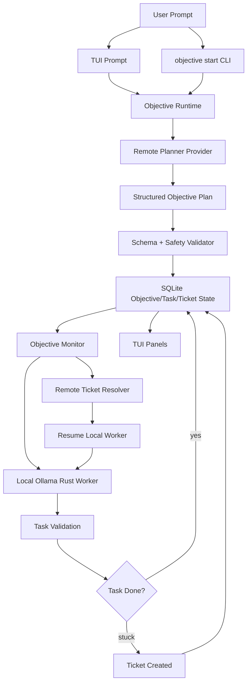

# Phase 3 Plan: Prompt-First Objective Orchestration

## Summary

Phase 3 shifts `harness` from a command-first supervisor into a prompt-first agent system.

The user should be able to enter a natural-language objective, such as:

```text
Create a Rust clone of the Volt CLI in this repository: https://github.com/Arm-Volt/volt-cli
```

`harness` should then:

1. Send the objective, repository context, and system planning instructions to the OpenAI-compatible remote LLM.
2. Receive a strict structured objective plan.
3. Persist the objective, acceptance criteria, generated validation, and generated local tasks.
4. Run bounded implementation tasks through the local Ollama-hosted Rust model.
5. Create tickets when local workers get stuck.
6. Use the remote LLM again only when a ticket needs resolution.
7. Resume local Ollama work with the ticket solution.
8. Repeat until acceptance criteria pass, the objective is blocked, or configured limits are reached.

The TUI should become a Codex-like prompt surface plus an objective dashboard. Unlike a plain Codex CLI session, `harness` should keep visible panels for running tasks, open tickets, objective progress, worker state, validation status, and transcript events.

## Core Principle

Use the large remote model for reasoning and coordination. Use the local Rust-focused Ollama model for repository implementation.

The OpenAI-compatible model is responsible for:

- Initial objective planning.
- Defining "done" and acceptance criteria.
- Decomposing the objective into bounded implementation tasks.
- Resolving tickets when local workers get stuck.

The local Ollama Rust model is responsible for:

- Applying patches.
- Iterating through task attempts.
- Running validation.
- Producing stuck tickets when blocked.

The remote model should not be involved during normal local task execution. Once local work starts, the remote model should re-enter the loop only when there is an open ticket requiring higher-level reasoning.

## Goals

- Make the normal TUI workflow prompt-first rather than command-first.
- Add persisted `objective` state as the top-level unit of work.
- Add a remote planner that returns strict machine-readable plans.
- Generate acceptance criteria and validation commands from the user's initial prompt.
- Convert planner output into local tasks that can be supervised by the existing Ollama worker loop.
- Add an objective monitor that keeps local workers moving and resolves tickets through the remote LLM when needed.
- Keep the TUI panels that show tasks, tickets, worker activity, validation state, and transcript events.
- Preserve direct CLI and slash-command escape hatches for inspection and manual control.

## Non-Goals

- Do not make the remote model directly apply repository patches.
- Do not remove command-mode functionality from the CLI.
- Do not hide task/ticket state behind a chat-only experience.
- Do not require the user to manually create tasks for the normal path.
- Do not build arbitrary multi-model scheduling beyond the planner/ticket-resolver/local-worker roles.
- Do not trust generated validation scripts without validation, review, sandboxing, or an explicit policy.

## User Experience

### TUI Prompt-First Mode

Running `harness` without a command opens the TUI:

```sh
harness --repo "$REPO"
```

Plain input is treated as an objective prompt:

```text
> Create a Rust clone of the Volt CLI in this repository: https://github.com/Arm-Volt/volt-cli
```

The TUI should then show planning progress, generated tasks, worker execution, tickets, ticket resolution, validation, and final acceptance status.

Harness commands remain available through slash commands:

```text
> /objective list
> /objective get objective_...
> /task list
> /ticket list --status open
> /supervise task_...
```

Shell escapes remain available:

```text
> !git status --short
```

### One-Shot CLI

The same workflow should be available without the TUI:

```sh
harness --repo "$REPO" objective start \
  "Create a Rust clone of the Volt CLI in this repository: https://github.com/Arm-Volt/volt-cli" \
  --output json
```

Supervising an existing objective should be explicit:

```sh
harness --repo "$REPO" objective supervise objective_... --output json
```

The CLI should be suitable for Codex or automation to drive directly.

## High-Level Architecture



## Remote Planner Contract

The planner prompt should combine:

- A stable system prompt that explains the `harness` architecture and role boundaries.
- The full relevant conversation for the current objective.
- Repository context and available files.
- Existing task/ticket/objective state when replanning.
- Tooling constraints and safety rules.
- The user's objective prompt.

The planner response must be strict structured data. It should not be free-form prose.

Representative schema:

```json
{
  "objective": {
    "title": "Create Rust clone of Volt CLI",
    "summary": "Implement a Rust CLI with the core behavior and command surface of Arm-Volt/volt-cli.",
    "acceptance_criteria": [
      "Rust CLI builds successfully",
      "Core Volt CLI command groups are represented",
      "Help output exists for implemented commands",
      "Fixture tests validate representative workflows",
      "Final validation script passes"
    ],
    "validation_commands": [
      "cargo fmt --check",
      "cargo test",
      ".harness/validation/acceptance.sh"
    ]
  },
  "tasks": [
    {
      "title": "Inspect Volt CLI command surface",
      "goal": "Determine command groups, options, and key workflows from the source Volt CLI project.",
      "validation": ".harness/validation/command-surface-known.sh",
      "depends_on": [],
      "owned_paths": [],
      "parallel_group": "discovery"
    },
    {
      "title": "Implement Rust CLI skeleton",
      "goal": "Create a clap-based Rust CLI with command groups matching the planned Volt CLI surface.",
      "validation": "cargo test cli_surface",
      "depends_on": ["Inspect Volt CLI command surface"],
      "owned_paths": ["src/cli/**", "tests/cli_surface.rs"],
      "parallel_group": "cli"
    }
  ],
  "risks": [
    "Source repository behavior may require network or credentials to inspect completely."
  ],
  "final_verification": [
    "Run all objective validation commands",
    "Summarize implemented command parity"
  ]
}
```

## System Prompt Requirements

The remote planner and ticket resolver need separate system prompts.

### Planner System Prompt

The planner system prompt should instruct the remote model to:

- Treat the user prompt as the top-level objective.
- Define acceptance criteria and validation commands.
- Break the objective into small local-worker tasks.
- Prefer tasks that can be completed independently and validated locally.
- Mark dependencies and parallelizable groups.
- Produce strict JSON matching the planner schema.
- Avoid direct repository patch instructions unless they are task goals for local workers.
- Avoid using the remote model for implementation work.
- Include enough context for local workers to act without repeated remote calls.

### Ticket Resolver System Prompt

The ticket resolver prompt should instruct the remote model to:

- Read the ticket, task goal, validation failure, artifacts, and prior attempts.
- Diagnose why the local worker got stuck.
- Return a bounded resolution that can be inserted into the next local Ollama prompt.
- Avoid direct patch application.
- Include concrete guidance, commands to inspect, and likely fix direction.
- Preserve any relevant conversation context from the original objective and prior ticket resolutions.

## Conversation And Context Model

Remote calls should include the complete relevant conversation for the objective, similar to Codex-style context accumulation.

Persist:

- Original user objective prompt.
- Planner system prompt version.
- Planner request context manifest.
- Planner response.
- User follow-up prompts if any.
- Objective plan revisions.
- Generated tasks.
- Ticket prompts and resolutions.
- Final acceptance summaries.

For token limits, use deterministic context packing:

- Always include the objective prompt and current acceptance criteria.
- Always include current objective/task/ticket status.
- Always include the current ticket details for ticket resolution.
- Include recent transcript events.
- Include artifact manifests and selected excerpts.
- Truncate large evidence with clear labels and byte counts.

## Objective State Model

Add persisted objective-level state.

Suggested entities:

- `objectives`
  - `id`
  - `title`
  - `prompt`
  - `summary`
  - `status`: `planning`, `ready`, `running`, `blocked`, `complete`, `failed`, `cancelled`
  - `planner_model`
  - `created_at`
  - `updated_at`
- `objective_acceptance_criteria`
  - `id`
  - `objective_id`
  - `description`
  - `status`: `pending`, `passing`, `failing`, `waived`
- `objective_validation_commands`
  - `id`
  - `objective_id`
  - `command`
  - `source`: `planner`, `user`, `system`
  - `review_status`: `trusted`, `needs_review`, `rejected`
- `objective_tasks`
  - `objective_id`
  - `task_id`
  - `depends_on`
  - `parallel_group`
  - `owned_paths`
- `objective_events`
  - `objective_id`
  - `event_type`
  - `message`
  - `payload_json`
  - `created_at`
- `planner_exchanges`
  - `objective_id`
  - `kind`: `initial_plan`, `replan`, `ticket_resolution`
  - `request_manifest_path`
  - `response_path`
  - `model`
  - `created_at`

Existing task, run, ticket, artifact, and event tables should remain the implementation substrate.

## Objective Monitor

The objective monitor owns the high-level loop:

```text
while objective not terminal:
  refresh objective state
  if objective has no plan:
    call remote planner
    validate and persist plan
    create local tasks

  start ready local tasks up to concurrency limit
  observe running local tasks

  for each open ticket needing resolution:
    call remote ticket resolver
    persist resolution
    resume local worker

  run objective-level validation when task graph appears complete
  mark complete, blocked, or continue
```

Default local worker attempt budget should be high enough for real tasks. Use a default such as `32` local model turns/attempts for objective-created tasks unless overridden.

The monitor may begin as a foreground process in Phase 3, but it should be designed so a later background supervisor can reuse the same loop.

## Local Worker Policy

Local workers should:

- Receive a bounded task goal generated by the planner.
- Receive relevant objective acceptance criteria.
- Receive any ticket resolution guidance when resuming.
- Use the existing patch safety path.
- Run task validation after each attempt.
- Stop when validation passes, the worker gets stuck, cancellation is requested, or the attempt limit is reached.
- Create a ticket with enough artifacts for the remote resolver when stuck.

The remote model should not be called between local attempts unless a ticket is created.

## TUI Requirements

The Phase 3 TUI must remain panel-rich.

Required panels:

- Objective summary and status.
- Acceptance criteria and current pass/fail state.
- Planner status and latest plan revision.
- Task queue grouped by ready/running/stuck/complete.
- Active local Ollama workers and attempt counts.
- Open/resolving/resolved tickets.
- Remote model activity for planning and ticket resolution.
- Validation progress.
- Transcript of objective events.

The prompt should support:

- Plain objective prompts.
- Follow-up prompts attached to the current objective.
- Slash commands for manual harness commands.
- Shell escapes with `!`.
- Existing completion behavior for slash commands.

The TUI should make it obvious when work is happening even if no text is being typed by the user.

## CLI Surface

Proposed commands:

```sh
harness objective start <prompt>
harness objective list
harness objective get <objective-id>
harness objective plan <objective-id>
harness objective supervise <objective-id>
harness objective validate <objective-id>
harness objective cancel <objective-id>
```

Direct Phase 2 commands should remain available:

```sh
harness task list
harness ticket list
harness supervise <task-id>
```

In the TUI, these direct commands should be accessed as slash commands:

```text
> /task list
> /ticket list
> /objective get objective_...
```

## Validation Strategy

Phase 3 should be validated end-to-end by driving the real CLI and TUI paths with fake providers.

Required test categories:

- Planner schema parsing and rejection tests.
- Planner prompt construction and context packing tests.
- Objective persistence and migration tests.
- Objective-start CLI e2e test with fake OpenAI-compatible planner.
- Generated task creation tests.
- Monitor loop tests where generated local tasks complete.
- Monitor loop tests where local tasks create tickets and remote resolver resumes them.
- TUI PTY tests for prompt-first input and visible objective/task/ticket panels.
- Regression tests for slash commands and shell escapes.
- Safety tests for rejected malformed planner output and unsafe generated validation.

## Acceptance Criteria

- A user can enter a plain-language objective in the TUI.
- A user can start the same objective from the CLI.
- The OpenAI-compatible planner receives the objective plus system context and returns strict structured output.
- `harness` validates the planner output before creating state.
- `harness` persists objective, acceptance criteria, validation commands, plan metadata, and generated tasks.
- Generated local tasks are executed by the existing Ollama worker path.
- Default objective-created local tasks use a high attempt budget, initially `32`, unless overridden.
- The remote model does not participate in normal local task attempts.
- Open tickets are resolved by the remote ticket resolver.
- Resolved ticket guidance is used to resume local Ollama workers.
- The objective monitor repeats until acceptance criteria pass, the objective is blocked, or limits are reached.
- The TUI visibly shows objective progress, task activity, open tickets, remote resolver activity, and validation status.
- Slash-command/manual command workflows remain available.

## Risks And Open Questions

- Generated validation scripts are powerful and need a trust/review policy before automatic execution.
- Remote planning for external repositories may need network access, cloning, or source snapshots.
- Objective planning may require replanning if generated tasks prove insufficient.
- Parallel local workers can create file conflicts unless task ownership and scheduling are enforced.
- Token limits require careful context packing for long objectives and repeated tickets.
- TUI complexity may grow quickly; keep data models clean and renderer state separate from orchestration state.

## Parallel Workstreams For Later Task Lists

These workstreams should be considered when turning this plan into implementation task lists:

1. Objective domain model, SQLite migrations, and repositories.
2. Planner schema, validation, and prompt construction.
3. Objective CLI commands and runtime dispatch.
4. Objective monitor orchestration loop.
5. Ticket resolver prompt/context updates for objective-aware resolution.
6. Generated validation command policy and execution.
7. Prompt-first TUI composer and slash-command mode.
8. Objective dashboard panels and transcript events.
9. End-to-end fake-provider tests.
10. PTY tests for TUI prompt-first workflow and progress visualization.
