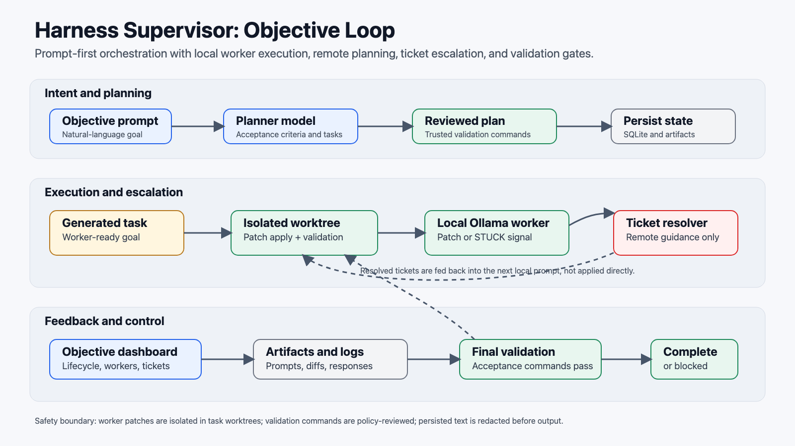
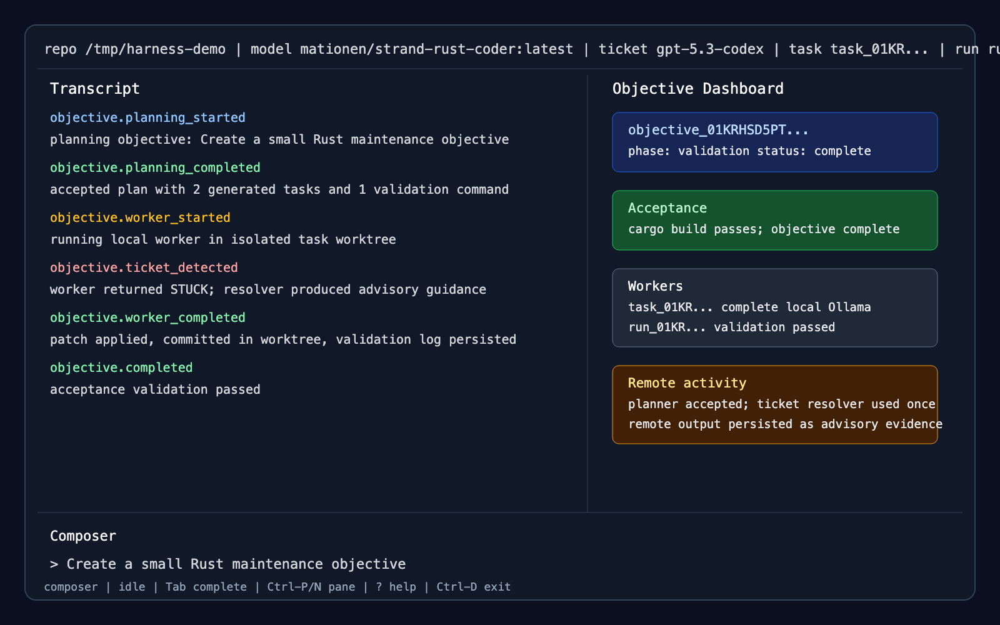
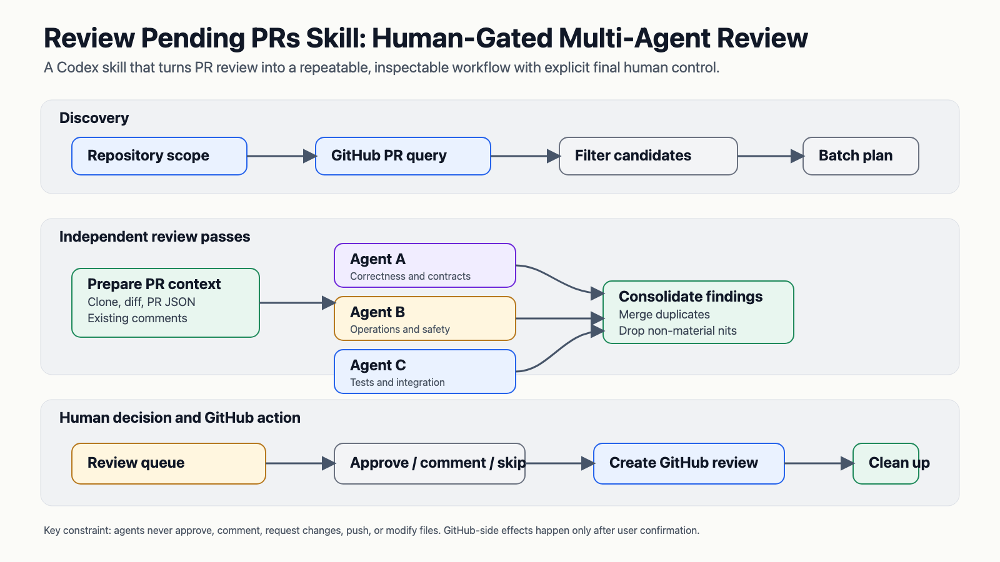
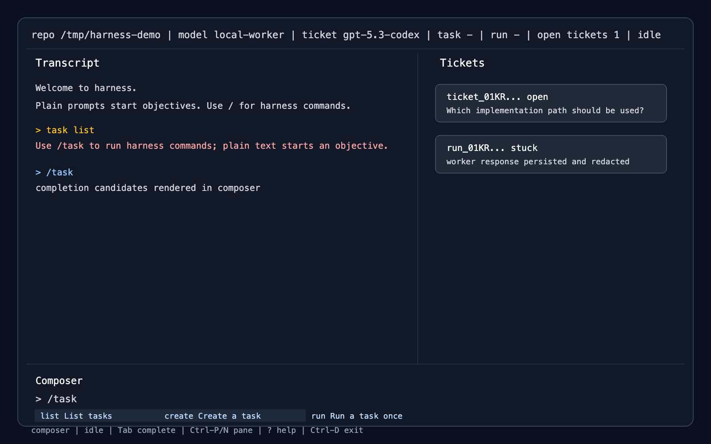

# 🧠 Agentic Log

**Submitted by:** Mike Lindegarde

**Date:** 18/05/26

**Tool and version:** Codex / GPT-5 family, Rust 2024, `ratatui` 0.29, local Ollama-compatible worker models, OpenAI-compatible planner/resolver models, GitHub CLI, Codex skills and sub-agents

## 💡 What I Tried

During Agentic Acceleration Week I focused on two related experiments:

1. Building a Rust supervisor called `harness` for goal-driven coding work.
2. Creating a Codex skill for reviewing pending GitHub pull requests with multiple reviewer agents.

The bigger experiment was the supervisor. I wanted to see what it would take to move from "ask one agent to do a task" to a more controlled loop where an objective is planned, split into tasks, executed locally, escalated when blocked, and validated before being called complete.

The intended workflow is prompt-first:

1. A user gives the system an objective, such as "Create a Rust clone of the Volt CLI in this repository."
2. An OpenAI-compatible planner turns that objective into acceptance criteria, validation commands, and small generated tasks.
3. Local Ollama-compatible workers implement those tasks in isolated git worktrees.
4. If a worker gets stuck, the system creates a ticket.
5. A stronger remote resolver answers the ticket.
6. The local worker resumes with that resolution included as evidence.
7. The monitor repeats until acceptance validation passes, the objective blocks, fails, is cancelled, or a cycle limit is reached.

I also built out the terminal UI around that workflow. The TUI has a transcript, side panes for tasks/tickets/runs/artifacts, a prompt-first composer, shell escape support, completions, and an objective dashboard that shows the current phase of the loop.

The other thread was the PR reviewer skill. I created a Codex skill that discovers human-authored GitHub PRs, prepares local review context, runs three independent sub-agent review passes, consolidates findings, and then asks the human reviewer what to approve, comment on, request changes for, or skip.

The skill deliberately keeps the agent side read-only until the final human decision. Agents can inspect PR context and propose comments, but they cannot approve, comment, request changes, push, or modify files.

The PR review skill supports recent PRs, all open PRs, PRs assigned to me or requesting review, PRs from a named requester, and direct targets like `volt-config PR 1706`. It uses a single helper script for GitHub discovery, PR context capture, review comment lookup, clone preparation, batch planning, review submission, and cleanup.

## ✅ What Worked Well

The prompt-first supervisor UX was the right shape. Treating plain text as an objective and reserving slash commands for manual inspection made the TUI feel closer to how I actually want to drive an agentic coding tool. The compatibility warnings for command-shaped plain text also helped avoid accidentally starting an objective when I meant to run a harness command.

Splitting responsibilities between remote planning/resolution and local implementation worked well as a safety model. The planner and ticket resolver can use a stronger remote model for judgement-heavy work, while implementation stays in local worktrees where patches, validation logs, and artifacts are inspectable.

The ticket loop was useful as a control point. Instead of letting a worker invent its way through uncertainty forever, it can return `STUCK` with a reason and question. The supervisor persists that as a ticket, resolves it, and feeds the answer back into the next local worker prompt as advisory evidence rather than applying remote output directly.

The TUI made the system much easier to reason about. A transcript alone is not enough once the process has objectives, generated tasks, tickets, runs, artifacts, validation, and cancellation. The dashboard gives a compact view of what is active, what is blocked, and what completed.

The safety rails were worth the time. I added or hardened behavior around isolated task worktrees, validation command review, shell escape environment sanitization, terminal output sanitization, secret redaction, persisted artifacts, and final validation. These are not glamorous parts of the system, but without them the supervisor would be hard to trust.

The PR reviewer skill was a good fit for Codex skills. The workflow has a lot of policy: which PRs to consider, how to avoid bot PRs, how many sub-agents to run, what each reviewer should focus on, how to avoid duplicate comments, when to clean up, and when the human must decide. Encoding that as a reusable skill made the process much more repeatable than trying to remember the whole review protocol each time.

The three-reviewer pattern was also useful. Having one agent focus on correctness/contracts, one on operations/safety, and one on tests/integration produced a better review frame than asking three agents to do the same generic pass.

## ⚠️ What Didn’t Work

The supervisor needed much more explicit steering than I expected. Broad goals caused local workers to get stuck too easily or ask questions that could have been answered with reasonable defaults. I had to make generated task goals more worker-ready, include acceptance criteria directly in the worker prompt, and tell workers to create conventional missing scaffolding rather than returning `STUCK` for every underspecified detail.

Validation policy is harder than just running whatever the planner suggests. A planner can propose commands that are useful but too broad, too mutating, or too dependent on external state. I added command review and a trusted-command policy, but this area still needs care because validation is where the supervisor decides whether the work is actually done.

The local/remote model split has practical setup friction. The workflow depends on a local Ollama-compatible worker server, an OpenAI-compatible planner/resolver endpoint, API key configuration, trusted enterprise certificates, and a clean or disposable git repository. When any of those pieces are wrong, the failure mode can look like an agent problem even though it is really environment setup.

The TUI is useful, but it is not yet a full background service. Closing the TUI stops the foreground command even though persisted state remains in `.harness/`. That is acceptable for this experiment, but a more production-ready supervisor would probably separate the long-running monitor from the terminal UI.

The PR reviewer skill still depends on human judgement. It can discover PRs, prepare context, run review passes, and propose comments, but it should not decide on its own whether a finding is worth posting or whether a PR should be approved. This is a feature, not just a limitation: review comments carry social and engineering weight, so the human should remain the final gate.

GitHub integration also introduces normal operational fragility. The helper needs `gh` installed and authenticated, repository access, readable diffs, and valid review comment locations. Inline comment placement can fail if the line is not part of the diff, so the workflow needs a fallback decision instead of guessing.

## 🧠 Tips for Others

Make the agent loop visible. A multi-step agentic workflow needs inspectable state, not just a chat transcript. Show objectives, tasks, tickets, runs, artifacts, validation, and the current phase.

Use git worktrees or equivalent isolation for autonomous implementation. It is much easier to trust agents when their patches land in a bounded workspace and can be validated before anything touches the main checkout.

Treat remote model output as advice unless you have a very strong reason not to. In the supervisor, resolver output is persisted and fed into the next local worker prompt, but it is not applied directly as a patch.

Make validation commands part of the contract, and review them before execution. Agents are much more useful when success is mechanically checkable, but command execution is also one of the places where safety problems can enter.

Package repeatable workflows as skills. The PR review process had enough decisions, guardrails, and sequencing rules that it became much more useful once encoded as a skill with a helper script.

Use multiple reviewer perspectives rather than duplicate generic reviewers. For PR review, separating correctness, operations, and test/integration concerns produced a clearer consolidation step.

Keep the human gate where the action has real consequences. It is reasonable for agents to gather context and draft review comments. It is not reasonable for them to approve or request changes without explicit human confirmation.

Expect to spend time on boring reliability work. Redaction, artifact storage, cancellation, terminal cleanup, command policy, retry limits, and setup diagnostics matter as much as the agent prompt when the goal is a workflow someone can actually use.
