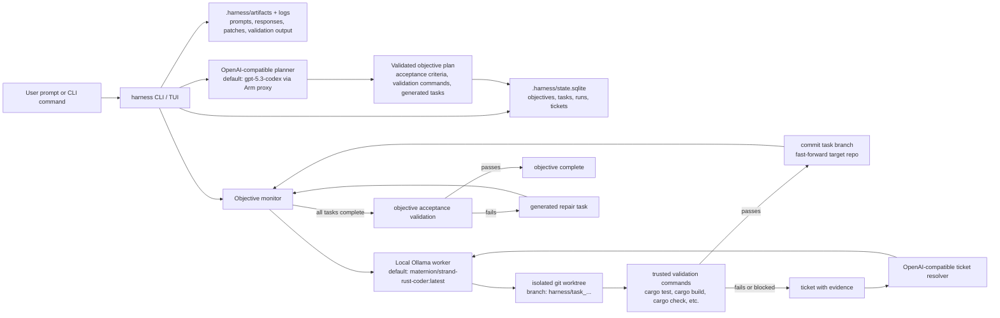
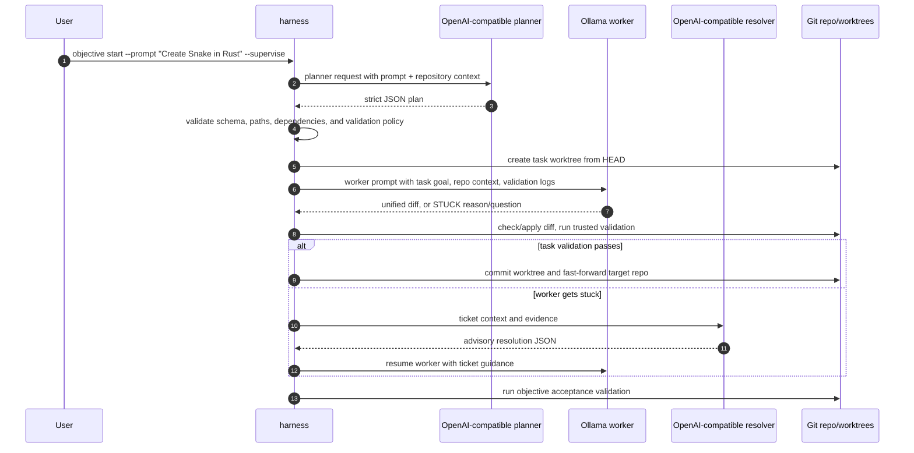

# Harness Supervisor



`harness` is a Rust CLI and terminal UI for supervising AI-assisted coding work in a git repository. You give it a natural-language objective; it asks an OpenAI-compatible planner to turn that objective into a structured plan; then it runs local Ollama coding workers against generated tasks in isolated git worktrees. The main repository is updated only after a task validates and its task branch can be fast-forwarded back into the target checkout.

The project has three main loops:



## How The Pieces Fit Together

- **CLI/TUI**: `harness` can run as a normal CLI or as a prompt-first TUI when started with no command in a terminal.
- **Objective planner**: `objective start` sends the prompt plus a compact repository context to the OpenAI-compatible provider. The response must be strict JSON containing an objective summary, acceptance criteria, validation commands, generated tasks, task dependencies, risks, and final verification notes.
- **Plan validation**: planner output is checked before use. The code rejects invalid schemas, invalid task graphs, repo path escapes, too many tasks, and generated tasks without at least one trusted validation command.
- **Task worker**: generated tasks are executed by the local Ollama provider. The worker must return either a fenced unified diff or a `STUCK` response with a reason and question.
- **Worktrees**: each task runs in an isolated git worktree and task branch. Successful task attempts are committed in that worktree; completed generated tasks are then fast-forwarded into the target repository.
- **Tickets**: when a worker cannot make progress, `harness` stores a ticket with evidence such as validation output, prior attempts, current diff, and worker responses.
- **Ticket resolver**: the OpenAI-compatible resolver answers tickets with advisory guidance only. It does not directly patch the repo.
- **Acceptance validation**: after generated tasks are complete, `harness` runs trusted objective-level validation commands. If they fail, the objective monitor can create a repair task and continue.

Use a disposable or clean git repository first. The tool writes `.harness/config.toml`, `.harness/state.sqlite`, `.harness/logs/`, `.harness/artifacts/`, and task worktrees under the configured worktree root. Model-generated patches are applied inside task worktrees first, not directly to your main checkout.

## Example CLI Commands

Initialize a target repository and verify local setup:

```sh
REPO=/path/to/disposable/snake-rust
harness --repo "$REPO" init --output json
harness --repo "$REPO" doctor --offline --output json
harness --repo "$REPO" doctor --providers local --output json
harness --repo "$REPO" doctor --providers all --output json
```

Start the prompt-first workflow from the TUI:

```sh
harness --repo "$REPO"
```

Then enter a prompt such as:

```text
Create the game Snake using Rust. Build it as a terminal-playable Rust project with conventional Cargo structure, keyboard controls, scoring, collision detection, and tests where practical.
```

Run the same workflow without opening the TUI:

```sh
harness --repo "$REPO" objective start \
  --prompt "Create the game Snake using Rust. Build it as a terminal-playable Rust project with conventional Cargo structure, keyboard controls, scoring, collision detection, and tests where practical." \
  --supervise \
  --planner-model gpt-5.3-codex \
  --worker-model maternion/strand-rust-coder:latest \
  --ticket-model gpt-5.3-codex \
  --max-worker-attempts 32 \
  --max-cycles 16 \
  --output json
```

Inspect or resume the work:

```sh
harness --repo "$REPO" objective list
harness --repo "$REPO" objective get <objective-id>
harness --repo "$REPO" objective plan <objective-id>
harness --repo "$REPO" objective supervise <objective-id> --max-worker-attempts 32 --max-cycles 16
harness --repo "$REPO" objective validate <objective-id> --dry-run
harness --repo "$REPO" objective validate <objective-id>
```

## Snake Objective Walkthrough

Given a prompt to create Snake in Rust, the system should behave like this in theory:

1. `harness objective start` creates an objective in `.harness/state.sqlite` with status `planning`.
2. The planner call goes to the configured OpenAI-compatible endpoint, by default the Arm OpenAI API proxy using `gpt-5.3-codex`.
3. The planner returns a JSON plan. For a simple Snake prompt, a good plan is usually one generated implementation task that creates or updates `Cargo.toml` and `src/main.rs`, plus validation such as `cargo build`, `cargo test`, or `cargo check`. The planner may choose a different valid breakdown if the repository already contains relevant code.
4. `harness` validates the plan. It accepts only safe, unattended validation commands from the allowlist and rejects shell chaining, redirection, destructive commands, path escapes, and tasks that cannot be validated.
5. The objective monitor selects the next ready generated task and invokes the local Ollama worker model, by default `maternion/strand-rust-coder:latest`.
6. The worker sees the task goal, repository context, any current diff, prior attempt summaries, and validation logs. It returns a unified diff that implements the Rust Snake project, or it returns `STUCK` with a concrete question.
7. `harness` checks patch safety, applies the diff in the task worktree, runs the task validation commands, and records prompt/response/patch/validation artifacts.
8. If validation passes, `harness` commits the worktree changes and fast-forwards the target repo from the task branch.
9. If validation fails repeatedly or the worker returns `STUCK`, `harness` opens a ticket. The OpenAI-compatible resolver returns bounded guidance, and the local Ollama worker resumes with that guidance.
10. After all generated tasks complete, `harness` runs objective acceptance validation. Passing validation marks the objective `complete`; failing validation can create a repair task; exhausting cycles or worker attempts marks the objective blocked or failed.

## Build And Install

From this repository:

```sh
cargo build
./target/debug/harness --help
```

For day-to-day use, install the local binary so examples can use `harness` directly:

```sh
cargo install --path .
harness --help
```

During development you can also run through Cargo:

```sh
cargo run -- --help
```

## Prerequisites

- Rust and Cargo installed.
- A target git repository with a committed baseline.
- A local Ollama-compatible model server for task implementation.
- An OpenAI-compatible API key for objective planning and ticket resolution.

Default provider settings are written to `.harness/config.toml` during `init`:

- Ollama base URL: `http://localhost:11434`
- Ollama model: `maternion/strand-rust-coder:latest`
- OpenAI-compatible base URL: Arm OpenAI API proxy
- OpenAI-compatible model: `gpt-5.3-codex`
- API key env: `OPENAI_API_KEY`, fallback `ARM_OPENAI_API_KEY`

Edit `.harness/config.toml` in the target repo if your provider setup differs.

HTTPS provider calls use the operating system trust store. If your network uses an enterprise TLS inspection proxy, install the enterprise root CA into your OS/keychain trust store before running planner or ticket resolver calls. An `UnknownIssuer` certificate error means the proxy/API certificate chain is not trusted by the machine running `harness`.

## Quick Start

Set a target repository:

```sh
REPO=/path/to/your/git/repo
```

Initialize harness state and config:

```sh
harness --repo "$REPO" init --output json
```

Check local setup without provider network calls:

```sh
harness --repo "$REPO" doctor --offline --output json
```

Check provider readiness:

```sh
harness --repo "$REPO" doctor --providers local --output json
harness --repo "$REPO" doctor --providers all --output json
```

Start the full prompt-first TUI:

```sh
harness --repo "$REPO"
```

Then type a natural-language objective and press `Enter`:

```text
> Create a Rust clone of the Volt CLI in this repository: https://github.com/Arm-Volt/volt-cli
```

The TUI routes plain prompts to:

```sh
harness objective start --supervise --prompt "<your prompt>"
```

The right-side dashboard shows objective planning, generated task execution, ticket resolution, worker resume, validation, and final terminal state.

## One-Command Objective Workflow

You can drive the same objective workflow without opening the TUI:

```sh
harness --repo "$REPO" objective start \
  --prompt "Create a Rust clone of the Volt CLI in this repository: https://github.com/Arm-Volt/volt-cli" \
  --supervise \
  --max-worker-attempts 32 \
  --max-cycles 16 \
  --output json
```

Useful objective options:

- `--prompt <text>`: provide the objective text directly.
- `--prompt-file <path>`: read the objective text from a file.
- `--stdin`: read the objective text from standard input.
- `--supervise`: immediately run the objective monitor after planning.
- `--planner-model <model>`: override the OpenAI-compatible planning model.
- `--worker-model <model>`: override the local Ollama implementation model.
- `--ticket-model <model>`: override the OpenAI-compatible ticket resolver model.
- `--max-worker-attempts <n>`: cap local worker attempts per generated task. Use `32` for the intended long-running local loop.
- `--max-cycles <n>`: cap objective monitor cycles.
- `--output json`: write exactly one final JSON object to stdout. Progress events are emitted as NDJSON on stderr.

If an objective was already planned, supervise it by ID:

```sh
harness --repo "$REPO" objective supervise <objective-id> \
  --max-worker-attempts 32 \
  --max-cycles 16 \
  --output json
```

Inspect objective state:

```sh
harness --repo "$REPO" objective list
harness --repo "$REPO" objective list --status running
harness --repo "$REPO" objective get <objective-id>
harness --repo "$REPO" objective plan <objective-id>
harness --repo "$REPO" objective validate <objective-id> --dry-run
harness --repo "$REPO" objective validate <objective-id>
harness --repo "$REPO" objective cancel <objective-id>
```

## Interactive TUI

Run `harness` with no command to open the terminal UI:

```sh
harness --repo "$REPO"
```

The TUI has four main regions:

- Header: repo, local model, ticket model, active task/run context, open-ticket count, and current phase.
- Transcript: command output, objective progress, supervisor progress, validation summaries, shell escape output, and system messages.
- Side pane: Phase 2 task/ticket/run/artifact panes, or the Phase 3 Objective Dashboard when an objective is active.
- Composer: bottom prompt for natural-language objectives, slash commands, shell escapes, completions, hints, and compatibility warnings.

### TUI Input Modes

Plain prompt mode starts objectives:

```text
> Build a Rust CLI that matches this TypeScript project: https://github.com/example/project
```

Slash command mode runs harness commands. Use this for inspection, manual task/ticket operations, config, and generated completions:

```text
> /objective list
> /objective get objective_...
> /task list --status stuck
> /ticket get ticket_...
> /supervise task_... --max-attempts 2 --max-cycles 3
> /help
```

Shell escape mode runs a local shell command from the repo root with a sanitized environment:

```text
> !git status --short
> !cargo test
```

Prompt-first compatibility behavior:

- Plain `task list`, `ticket get ...`, `objective list`, `supervise ...`, and similar command-shaped inputs are blocked with a hint to use a leading slash.
- Use `/task list`, `/ticket get ...`, `/objective list`, `/supervise ...`, etc. for harness commands.
- Plain natural-language prompts such as `run the tests and fix failures` are treated as objectives, not legacy commands.

### TUI Keyboard Controls

Composer editing:

- Printable characters: insert at the cursor.
- `Left`: move cursor one character left.
- `Right`: move cursor one character right.
- `Home` or `Ctrl-A`: move cursor to the start of the prompt.
- `End` or `Ctrl-E`: move cursor to the end of the prompt.
- `Backspace`: delete the character before the cursor.
- `Ctrl-U`: delete everything before the cursor.
- `Ctrl-W`: delete the previous word.
- `Ctrl-C`: clear the current prompt. If a foreground command is running, request cooperative cancellation instead.
- `Ctrl-D`: exit when the prompt is empty.

Submission and completion:

- `Enter`: submit the prompt or slash command.
- `Enter` with a suggestion selected: apply that suggestion instead of submitting.
- `Tab` in slash command or shell escape mode: complete commands, flags, static values, task IDs, ticket IDs, objective IDs, or shell hints.
- `Tab` with one candidate: insert that candidate.
- `Tab` with multiple candidates: insert the longest common prefix when possible; otherwise show suggestions.
- `Tab` with suggestions visible and a selected suggestion: apply the selected suggestion.
- `Tab` in plain prompt mode: does not complete; it writes a transcript hint that prompt text starts an objective and `/` is used for harness commands.

Suggestions and history:

- `Up` with suggestions visible: move to the previous suggestion, wrapping at the top.
- `Down` with suggestions visible: move to the next suggestion, wrapping at the bottom.
- `Up` with no visible suggestions: move backward through in-memory prompt history.
- `Down` with no visible suggestions: move forward through in-memory prompt history, eventually restoring the draft you were editing.
- `Esc` with suggestions visible: hide suggestions.

Panes and scrolling:

- `Ctrl-N`: move to the next side pane.
- `Ctrl-P`: move to the previous side pane.
- `PageUp`: scroll the focused side pane when side-pane focus is active and rows exist; otherwise scroll transcript up.
- `PageDown`: scroll the focused side pane when side-pane focus is active and rows exist; otherwise scroll transcript down.
- `Esc` while transcript or side pane is focused: return focus to the composer.

Exit and cancellation:

- `Ctrl-D` on an empty prompt exits the TUI.
- `Ctrl-C` on an empty prompt exits the TUI.
- `/help` shows the command help in the transcript.
- `Ctrl-C` while a foreground command is running requests cancellation. If cancellation is acknowledged, the transcript includes a suggested resume/inspection command.

Current limitations:

- Command history is in-memory for the current TUI session.
- The TUI does not run as a background daemon; closing it stops foreground commands, but persisted state remains in `.harness/`.

## Slash Commands In The TUI

Inside the TUI, omit the leading `harness` but include the leading `/`:

```text
> /objective start --prompt "Fix all failing tests" --supervise
> /objective list --status blocked
> /objective supervise objective_... --max-worker-attempts 32
> /task list
> /task get task_...
> /ticket list --status open
> /ticket resolve ticket_...
> /resume task_... --ticket ticket_...
> /config get
> /workspace prune --dry-run
> /completions zsh
```

The line-oriented fallback shell used for piped/non-TTY input also accepts `exit` and `quit`.

Dynamic completion works for IDs:

- `/task get task_` completes task IDs.
- `/resume task_` completes task IDs.
- `/ticket get ticket_` completes ticket IDs.
- `/resume task_... --ticket ticket_` completes tickets scoped to the task where applicable.
- `/objective get objective_` completes objective IDs.
- `/objective supervise objective_` completes objective IDs.

## Lower-Level Task And Ticket Workflow

The prompt-first objective workflow is recommended. These commands remain useful for debugging or manual control.

Create a task without running it:

```sh
harness --repo "$REPO" task create \
  --title "Fix failing tests" \
  --goal "Make the test suite pass with the smallest safe patch" \
  --validation "cargo test" \
  --output json
```

Run a task once with the local model:

```sh
harness --repo "$REPO" task run <task-id> \
  --max-attempts 2 \
  --model maternion/strand-rust-coder:latest \
  --output json
```

If a run completes, it exits with code `0`. If it gets stuck, it exits with code `10` and returns a `ticket_id`.

Resolve and resume manually:

```sh
export OPENAI_API_KEY=...

harness --repo "$REPO" ticket resolve <ticket-id> --output json
harness --repo "$REPO" resume <task-id> --ticket <ticket-id> --max-attempts 1 --output json
```

Use the foreground task supervisor when you want the older task-level loop:

```sh
harness --repo "$REPO" supervise <task-id> \
  --ticket <ticket-id> \
  --max-attempts 2 \
  --max-cycles 3 \
  --output json
```

Create and supervise a task in one command:

```sh
harness --repo "$REPO" supervise \
  --create \
  --title "Fix failing tests" \
  --goal "Make cargo test pass with the smallest safe patch" \
  --validation "cargo test" \
  --max-attempts 2 \
  --max-cycles 3 \
  --output json
```

One-shot create-and-run without automatic ticket resolution:

```sh
harness --repo "$REPO" run \
  --title "Fix failing tests" \
  --goal "Make cargo test pass" \
  --validation "cargo test" \
  --max-attempts 2 \
  --output json
```

Inspect task and ticket state:

```sh
harness --repo "$REPO" task list
harness --repo "$REPO" task list --status ready
harness --repo "$REPO" task get <task-id>
harness --repo "$REPO" ticket list
harness --repo "$REPO" ticket list --status open
harness --repo "$REPO" ticket get <ticket-id>
```

## Validation Commands

Planner-generated objective validation commands are reviewed before execution. Trusted commands include common test/check commands such as:

```sh
cargo test
cargo check
cargo build
cargo fmt --check
cargo clippy
go test ./...
npm test
pytest
```

Validation commands are executed through the configured shell with a sanitized environment. The runner preserves a sanitized absolute-entry `PATH` so commands such as `cargo test` can resolve normally while relative/current-directory PATH entries are dropped.

Avoid validation commands that mutate dependencies, publish artifacts, use shell metacharacters, depend on secrets, or reach outside the repository.

## Shell Completions

Interactive TUI completion works automatically inside `harness`.

For your outer shell, generate completion scripts with:

```sh
harness completions bash
harness completions zsh
harness completions fish
```

Example install commands:

```sh
# Bash
mkdir -p ~/.local/share/bash-completion/completions
harness completions bash > ~/.local/share/bash-completion/completions/harness

# Zsh
mkdir -p ~/.zfunc
harness completions zsh > ~/.zfunc/_harness
# Ensure ~/.zfunc is in fpath from your zsh config.

# Fish
mkdir -p ~/.config/fish/completions
harness completions fish > ~/.config/fish/completions/harness.fish
```

Open a new shell after installing completions.

## Output Modes

Human output is the default for most commands.

Use JSON for automation:

```sh
harness --repo "$REPO" objective start --prompt "Fix failing tests" --supervise --output json
```

For JSON commands:

- stdout contains exactly one final JSON object.
- stderr contains NDJSON progress events for streaming supervisor/objective progress.
- `--quiet` suppresses human-oriented informational output where applicable.

## Exit Codes

- `0`: command completed.
- `1`: command failed.
- `2`: usage or parse error.
- `10`: task is stuck and needs a ticket resolution.
- `20`: doctor/readiness failure.
- `30`: security policy blocked the operation.

## Files Created

In the target repository:

- `.harness/config.toml`: provider and runtime configuration.
- `.harness/state.sqlite`: objective, task, run, ticket, artifact, and event state.
- `.harness/artifacts/`: prompts, responses, patches, validation logs, manifests, planner artifacts, resolver artifacts, and ticket artifacts.
- `.harness/logs/`: runtime logs.

Task worktrees are created under the configured worktree root from `.harness/config.toml`.

## Safety Notes

- Provider prompts, artifacts, stdout/stderr, and SQLite fields are redacted for obvious secrets before persistence/output.
- OpenAI-compatible planning defines tasks and acceptance criteria but does not directly apply code.
- OpenAI-compatible ticket resolution is advisory only. Its output is stored as ticket-resolution evidence and is never directly applied as a patch.
- Local Ollama worker output must be either one diff fence or a strict `STUCK` block.
- Ticket resolutions are consumed only after they are included in the next local Ollama prompt.
- Patch safety, validation-command policy, sanitized command environments, and workspace isolation gate model-generated changes.
- CI-style e2e tests use fake providers; real provider smoke tests should be run manually against disposable repos.
